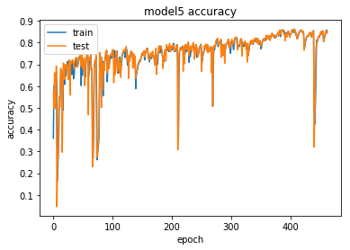
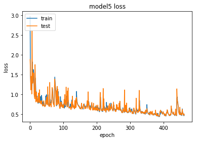

# Artificial Intelligence Nanodegree
## Machine Translation Project
In this notebook, sections that end with **'(IMPLEMENTATION)'** in the header indicate that the following blocks of code will require additional functionality which you must provide. Please be sure to read the instructions carefully!

## Introduction
In this notebook, you will build a deep neural network that functions as part of an end-to-end machine translation pipeline. Your completed pipeline will accept English text as input and return the French translation.

- **Preprocess** - You'll convert text to sequence of integers.
- **Models** Create models which accepts a sequence of integers as input and returns a probability distribution over possible translations. After learning about the basic types of neural networks that are often used for machine translation, you will engage in your own investigations, to design your own model!
- **Prediction** Run the model on English text.

## Dataset
We begin by investigating the dataset that will be used to train and evaluate your pipeline.  The most common datasets used for machine translation are from [WMT](http://www.statmt.org/).  However, that will take a long time to train a neural network on.  We'll be using a dataset we created for this project that contains a small vocabulary.  You'll be able to train your model in a reasonable time with this dataset.
### Load Data
The data is located in `data/small_vocab_en` and `data/small_vocab_fr`. The `small_vocab_en` file contains English sentences with their French translations in the `small_vocab_fr` file. Load the English and French data from these files from running the cell below.


```python
import helper


# Load English data
english_sentences = helper.load_data('data/small_vocab_en')
# Load French data
french_sentences = helper.load_data('data/small_vocab_fr')

print('Dataset Loaded')
```

    Dataset Loaded


### Files
Each line in `small_vocab_en` contains an English sentence with the respective translation in each line of `small_vocab_fr`.  View the first two lines from each file.


```python
for sample_i in range(2):
    print('small_vocab_en Line {}:  {}'.format(sample_i + 1, english_sentences[sample_i]))
    print('small_vocab_fr Line {}:  {}'.format(sample_i + 1, french_sentences[sample_i]))
```

    small_vocab_en Line 1:  new jersey is sometimes quiet during autumn , and it is snowy in april .
    small_vocab_fr Line 1:  new jersey est parfois calme pendant l' automne , et il est neigeux en avril .
    small_vocab_en Line 2:  the united states is usually chilly during july , and it is usually freezing in november .
    small_vocab_fr Line 2:  les états-unis est généralement froid en juillet , et il gèle habituellement en novembre .


From looking at the sentences, you can see they have been preprocessed already.  The puncuations have been delimited using spaces. All the text have been converted to lowercase.  This should save you some time, but the text requires more preprocessing.
### Vocabulary
The complexity of the problem is determined by the complexity of the vocabulary.  A more complex vocabulary is a more complex problem.  Let's look at the complexity of the dataset we'll be working with.


```python
import collections


english_words_counter = collections.Counter([word for sentence in english_sentences for word in sentence.split()])
french_words_counter = collections.Counter([word for sentence in french_sentences for word in sentence.split()])

print('{} English words.'.format(len([word for sentence in english_sentences for word in sentence.split()])))
print('{} unique English words.'.format(len(english_words_counter)))
print('10 Most common words in the English dataset:')
print('"' + '" "'.join(list(zip(*english_words_counter.most_common(10)))[0]) + '"')
print()
print('{} French words.'.format(len([word for sentence in french_sentences for word in sentence.split()])))
print('{} unique French words.'.format(len(french_words_counter)))
print('10 Most common words in the French dataset:')
print('"' + '" "'.join(list(zip(*french_words_counter.most_common(10)))[0]) + '"')
```

    1823250 English words.
    227 unique English words.
    10 Most common words in the English dataset:
    "is" "," "." "in" "it" "during" "the" "but" "and" "sometimes"
    
    1961295 French words.
    355 unique French words.
    10 Most common words in the French dataset:
    "est" "." "," "en" "il" "les" "mais" "et" "la" "parfois"


For comparison, _Alice's Adventures in Wonderland_ contains 2,766 unique words of a total of 15,500 words.
## Preprocess
For this project, you won't use text data as input to your model. Instead, you'll convert the text into sequences of integers using the following preprocess methods:
1. Tokenize the words into ids
2. Add padding to make all the sequences the same length.

Time to start preprocessing the data...
### Tokenize (IMPLEMENTATION)
For a neural network to predict on text data, it first has to be turned into data it can understand. Text data like "dog" is a sequence of ASCII character encodings.  Since a neural network is a series of multiplication and addition operations, the input data needs to be number(s).

We can turn each character into a number or each word into a number.  These are called character and word ids, respectively.  Character ids are used for character level models that generate text predictions for each character.  A word level model uses word ids that generate text predictions for each word.  Word level models tend to learn better, since they are lower in complexity, so we'll use those.

Turn each sentence into a sequence of words ids using Keras's [`Tokenizer`](https://keras.io/preprocessing/text/#tokenizer) function. Use this function to tokenize `english_sentences` and `french_sentences` in the cell below.

Running the cell will run `tokenize` on sample data and show output for debugging.


```python
import project_tests as tests
from keras.preprocessing.text import Tokenizer


def tokenize(x):
    """
    Tokenize x
    :param x: List of sentences/strings to be tokenized
    :return: Tuple of (tokenized x data, tokenizer used to tokenize x)
    """
    # TODO: Implement
    tokenizer = Tokenizer()
    tokenizer.fit_on_texts(x)
    tokenized_x = tokenizer.texts_to_sequences(x)
    return tokenized_x, tokenizer
tests.test_tokenize(tokenize)

# Tokenize Example output
text_sentences = [
    'The quick brown fox jumps over the lazy dog .',
    'By Jove , my quick study of lexicography won a prize .',
    'This is a short sentence .']
text_tokenized, text_tokenizer = tokenize(text_sentences)
print(text_tokenizer.word_index)
print()
for sample_i, (sent, token_sent) in enumerate(zip(text_sentences, text_tokenized)):
    print('Sequence {} in x'.format(sample_i + 1))
    print('  Input:  {}'.format(sent))
    print('  Output: {}'.format(token_sent))
```

    {'quick': 2, 'over': 7, 'fox': 5, 'study': 13, 'short': 20, 'dog': 9, 'by': 10, 'of': 14, 'a': 3, 'prize': 17, 'is': 19, 'jumps': 6, 'my': 12, 'brown': 4, 'jove': 11, 'sentence': 21, 'lazy': 8, 'this': 18, 'won': 16, 'lexicography': 15, 'the': 1}
    
    Sequence 1 in x
      Input:  The quick brown fox jumps over the lazy dog .
      Output: [1, 2, 4, 5, 6, 7, 1, 8, 9]
    Sequence 2 in x
      Input:  By Jove , my quick study of lexicography won a prize .
      Output: [10, 11, 12, 2, 13, 14, 15, 16, 3, 17]
    Sequence 3 in x
      Input:  This is a short sentence .
      Output: [18, 19, 3, 20, 21]


### Padding (IMPLEMENTATION)
When batching the sequence of word ids together, each sequence needs to be the same length.  Since sentences are dynamic in length, we can add padding to the end of the sequences to make them the same length.

Make sure all the English sequences have the same length and all the French sequences have the same length by adding padding to the **end** of each sequence using Keras's [`pad_sequences`](https://keras.io/preprocessing/sequence/#pad_sequences) function.


```python
import numpy as np
from keras.preprocessing.sequence import pad_sequences


def pad(x, length=None):
    """
    Pad x
    :param x: List of sequences.
    :param length: Length to pad the sequence to.  If None, use length of longest sequence in x.
    :return: Padded numpy array of sequences
    """
    # TODO: Implement
    max_length = len(max(x, key=lambda x: len(x)))
    
    if (length == None):
        length = max_length
                     
    padded = pad_sequences(x, maxlen=length, padding='post')
    
    return np.array(padded)


tests.test_pad(pad)

# Pad Tokenized output
test_pad = pad(text_tokenized)
for sample_i, (token_sent, pad_sent) in enumerate(zip(text_tokenized, test_pad)):
    print('Sequence {} in x'.format(sample_i + 1))
    print('  Input:  {}'.format(np.array(token_sent)))
    print('  Output: {}'.format(pad_sent))
```

    Sequence 1 in x
      Input:  [1 2 4 5 6 7 1 8 9]
      Output: [1 2 4 5 6 7 1 8 9 0]
    Sequence 2 in x
      Input:  [10 11 12  2 13 14 15 16  3 17]
      Output: [10 11 12  2 13 14 15 16  3 17]
    Sequence 3 in x
      Input:  [18 19  3 20 21]
      Output: [18 19  3 20 21  0  0  0  0  0]


### Preprocess Pipeline
Your focus for this project is to build neural network architecture, so we won't ask you to create a preprocess pipeline.  Instead, we've provided you with the implementation of the `preprocess` function.


```python
def preprocess(x, y):
    """
    Preprocess x and y
    :param x: Feature List of sentences
    :param y: Label List of sentences
    :return: Tuple of (Preprocessed x, Preprocessed y, x tokenizer, y tokenizer)
    """
    preprocess_x, x_tk = tokenize(x)
    preprocess_y, y_tk = tokenize(y)

    preprocess_x = pad(preprocess_x)
    preprocess_y = pad(preprocess_y)

    # Keras's sparse_categorical_crossentropy function requires the labels to be in 3 dimensions
    preprocess_y = preprocess_y.reshape(*preprocess_y.shape, 1)

    return preprocess_x, preprocess_y, x_tk, y_tk

preproc_english_sentences, preproc_french_sentences, english_tokenizer, french_tokenizer =\
    preprocess(english_sentences, french_sentences)

print('Data Preprocessed')
```

    Data Preprocessed


## Models
In this section, you will experiment with various neural network architectures.
You will begin by training four relatively simple architectures.
- Model 1 is a simple RNN
- Model 2 is a RNN with Embedding
- Model 3 is a Bidirectional RNN
- Model 4 is an optional Encoder-Decoder RNN

After experimenting with the four simple architectures, you will construct a deeper architecture that is designed to outperform all four models.
### Ids Back to Text
The neural network will be translating the input to words ids, which isn't the final form we want.  We want the French translation.  The function `logits_to_text` will bridge the gab between the logits from the neural network to the French translation.  You'll be using this function to better understand the output of the neural network.


```python
def logits_to_text(logits, tokenizer):
    """
    Turn logits from a neural network into text using the tokenizer
    :param logits: Logits from a neural network
    :param tokenizer: Keras Tokenizer fit on the labels
    :return: String that represents the text of the logits
    """
    index_to_words = {id: word for word, id in tokenizer.word_index.items()}
    index_to_words[0] = '<PAD>'

    return ' '.join([index_to_words[prediction] for prediction in np.argmax(logits, 1)])

print('`logits_to_text` function loaded.')
```

    `logits_to_text` function loaded.


### Model 1: RNN (IMPLEMENTATION)

A basic RNN model is a good baseline for sequence data.  In this model, you'll build a RNN that translates English to French.


```python
from keras.layers import GRU, Input, Dense, TimeDistributed, LSTM, Dropout
from keras.models import Model
from keras.layers import Activation
from keras.optimizers import Adam
from keras.losses import sparse_categorical_crossentropy


from keras.models import Sequential


def simple_model(input_shape, output_sequence_length, english_vocab_size, french_vocab_size):
    """
    Build and train a basic RNN on x and y
    :param input_shape: Tuple of input shape
    :param output_sequence_length: Length of output sequence
    :param english_vocab_size: Number of unique English words in the dataset
    :param french_vocab_size: Number of unique French words in the dataset
    :return: Keras model built, but not trained
    """
    
    print("INPUT SHAPE", input_shape[1:])
    # TODO: Build the layers
#     input_sequences = Input(shape=input_shape)
#     model = GRU(output_sequence_length, return_sequences=True)(input_sequences)
#     model = TimeDistributed(Dense(1))(model)
    
#     model = Sequential()
#     model.add(LSTM(output_sequence_length, input_shape=input_shape, return_sequences=True))
#     model.add(TimeDistributed(Dense(1)))
    
    model = Sequential()
    model.add(LSTM(output_sequence_length, input_shape=input_shape[1:], return_sequences=True))
    model.add(TimeDistributed(Dense(french_vocab_size)))
    print(model.summary())

    model.compile(loss=sparse_categorical_crossentropy,
                  optimizer=Adam(),
                  metrics=['accuracy'])
    return model
tests.test_simple_model(simple_model)


# Reshaping the input to work with a basic RNN
tmp_x = pad(preproc_english_sentences, preproc_french_sentences.shape[1])
print("INPUT SHAPE", tmp_x.shape)
tmp_x = tmp_x.reshape((-1, preproc_french_sentences.shape[-2], 1))

# Train the neural network
simple_rnn_model = simple_model(
    tmp_x.shape,
    preproc_french_sentences.shape[1],
    len(english_tokenizer.word_index) + 1,
    len(french_tokenizer.word_index) + 1)
```

    INPUT SHAPE (21, 1)
    _________________________________________________________________
    Layer (type)                 Output Shape              Param #   
    =================================================================
    lstm_1 (LSTM)                (None, 21, 21)            1932      
    _________________________________________________________________
    time_distributed_1 (TimeDist (None, 21, 344)           7568      
    =================================================================
    Total params: 9,500
    Trainable params: 9,500
    Non-trainable params: 0
    _________________________________________________________________
    None
    INPUT SHAPE (137861, 21)
    INPUT SHAPE (21, 1)
    _________________________________________________________________
    Layer (type)                 Output Shape              Param #   
    =================================================================
    lstm_2 (LSTM)                (None, 21, 21)            1932      
    _________________________________________________________________
    time_distributed_2 (TimeDist (None, 21, 345)           7590      
    =================================================================
    Total params: 9,522
    Trainable params: 9,522
    Non-trainable params: 0
    _________________________________________________________________
    None


```python
simple_rnn_model.fit(tmp_x, preproc_french_sentences, batch_size=1024, epochs=10, validation_split=0.2)
```

    Train on 110288 samples, validate on 27573 samples
    Epoch 1/10
    110288/110288 [==============================] - 11s - loss: 7.5395 - acc: 0.3311 - val_loss: 5.9861 - val_acc: 0.4126
    Epoch 2/10
    110288/110288 [==============================] - 5s - loss: 5.9509 - acc: 0.4032 - val_loss: 5.7734 - val_acc: 0.4239
    Epoch 3/10
    110288/110288 [==============================] - 5s - loss: 5.7712 - acc: 0.4135 - val_loss: 5.7829 - val_acc: 0.4180
    Epoch 4/10
    110288/110288 [==============================] - 5s - loss: 5.9237 - acc: 0.4106 - val_loss: 6.0198 - val_acc: 0.4090
    Epoch 5/10
    110288/110288 [==============================] - 5s - loss: 6.0216 - acc: 0.4166 - val_loss: 5.8082 - val_acc: 0.4213
    Epoch 6/10
    110288/110288 [==============================] - 5s - loss: 5.7633 - acc: 0.4225 - val_loss: 5.6862 - val_acc: 0.44450.422
    Epoch 7/10
    110288/110288 [==============================] - 5s - loss: 5.3801 - acc: 0.4419 - val_loss: 5.7385 - val_acc: 0.4188s - loss: 5.3
    Epoch 8/10
    110288/110288 [==============================] - 5s - loss: 4.8101 - acc: 0.4366 - val_loss: 3.8814 - val_acc: 0.4163
    Epoch 9/10
    110288/110288 [==============================] - 5s - loss: 3.8105 - acc: 0.4056 - val_loss: 3.7940 - val_acc: 0.4026
    Epoch 10/10
    110288/110288 [==============================] - 5s - loss: 3.7942 - acc: 0.4020 - val_loss: 3.7801 - val_acc: 0.4006


    <keras.callbacks.History at 0x7fd6c5b22ac8>


```python
# # TODO: Print prediction(s)
sentence_index = 5
print("ENGLISH:", english_sentences[sentence_index])
print("FRENCH:", logits_to_text(simple_rnn_model.predict(tmp_x[sentence_index:sentence_index + 1])[0], french_tokenizer))
```

    ENGLISH: his favorite fruit is the orange , but my favorite is the grape .
    FRENCH: relaxant du du du voulaient novembre redoutés novembre allé ce avez novembre et <PAD> <PAD> <PAD> <PAD> <PAD> <PAD> <PAD> <PAD>


### Model 2: Embedding (IMPLEMENTATION)

You've turned the words into ids, but there's a better representation of a word.  This is called word embeddings.  An embedding is a vector representation of the word that is close to similar words in n-dimensional space, where the n represents the size of the embedding vectors.

In this model, you'll create a RNN model using embedding.


```python
from keras.layers.embeddings import Embedding


def embed_model(input_shape, output_sequence_length, english_vocab_size, french_vocab_size):
    """
    Build and train a RNN model using word embedding on x and y
    :param input_shape: Tuple of input shape
    :param output_sequence_length: Length of output sequence
    :param english_vocab_size: Number of unique English words in the dataset
    :param french_vocab_size: Number of unique French words in the dataset
    :return: Keras model built, but not trained
    """
    # TODO: Implement
    model = Sequential()
    model.add(Embedding(english_vocab_size, 10, input_length=input_shape[1]))
    model.add(LSTM(output_sequence_length, input_shape=input_shape[1:], return_sequences=True))
    model.add(TimeDistributed(Dense(french_vocab_size)))
    print(model.summary())

    model.compile(loss=sparse_categorical_crossentropy,
                  optimizer=Adam(),
                  metrics=['accuracy'])
    return model
tests.test_embed_model(embed_model)


# TODO: Reshape the input

tmp_x = pad(preproc_english_sentences, preproc_french_sentences.shape[1])

# TODO: Train the neural network
embed_rnn_model = embed_model(
    tmp_x.shape,
    preproc_french_sentences.shape[1],
    len(english_tokenizer.word_index) + 1,
    len(french_tokenizer.word_index) + 1)
```

    _________________________________________________________________
    Layer (type)                 Output Shape              Param #   
    =================================================================
    embedding_1 (Embedding)      (None, 21, 10)            1990      
    _________________________________________________________________
    lstm_3 (LSTM)                (None, 21, 21)            2688      
    _________________________________________________________________
    time_distributed_3 (TimeDist (None, 21, 344)           7568      
    =================================================================
    Total params: 12,246
    Trainable params: 12,246
    Non-trainable params: 0
    _________________________________________________________________
    None
    _________________________________________________________________
    Layer (type)                 Output Shape              Param #   
    =================================================================
    embedding_2 (Embedding)      (None, 21, 10)            2000      
    _________________________________________________________________
    lstm_4 (LSTM)                (None, 21, 21)            2688      
    _________________________________________________________________
    time_distributed_4 (TimeDist (None, 21, 345)           7590      
    =================================================================
    Total params: 12,278
    Trainable params: 12,278
    Non-trainable params: 0
    _________________________________________________________________
    None


```python
embed_rnn_model.fit(tmp_x, preproc_french_sentences, batch_size=1024, epochs=10, validation_split=0.2)
```

    Train on 110288 samples, validate on 27573 samples
    Epoch 1/10
    110288/110288 [==============================] - 6s - loss: 3.5826 - acc: 0.3873 - val_loss: 2.8046 - val_acc: 0.4106
    Epoch 2/10
    110288/110288 [==============================] - 6s - loss: 2.6262 - acc: 0.4574 - val_loss: 2.2841 - val_acc: 0.5229
    Epoch 3/10
    110288/110288 [==============================] - 6s - loss: 2.1164 - acc: 0.5661 - val_loss: 1.9384 - val_acc: 0.5736
    Epoch 4/10
    110288/110288 [==============================] - 6s - loss: 1.9160 - acc: 0.5817 - val_loss: 1.8404 - val_acc: 0.5973
    Epoch 5/10
    110288/110288 [==============================] - 6s - loss: 1.8795 - acc: 0.5822 - val_loss: 1.8028 - val_acc: 0.5941
    Epoch 6/10
    110288/110288 [==============================] - 6s - loss: 1.8332 - acc: 0.5973 - val_loss: 1.7795 - val_acc: 0.6157
    Epoch 7/10
    110288/110288 [==============================] - 5s - loss: 1.8374 - acc: 0.5978 - val_loss: 1.7580 - val_acc: 0.6093
    Epoch 8/10
    110288/110288 [==============================] - 6s - loss: 1.7936 - acc: 0.5997 - val_loss: 1.8009 - val_acc: 0.6081
    Epoch 9/10
    110288/110288 [==============================] - 6s - loss: 1.7489 - acc: 0.6089 - val_loss: 1.6856 - val_acc: 0.6147
    Epoch 10/10
    110288/110288 [==============================] - 6s - loss: 1.7597 - acc: 0.6014 - val_loss: 1.7273 - val_acc: 0.6113


    <keras.callbacks.History at 0x7fd6c398da58>


```python
# # TODO: Print prediction(s)
sentence_index = 5
print("ENGLISH:", english_sentences[sentence_index])
print("FRENCH:", logits_to_text(embed_rnn_model.predict(tmp_x[sentence_index:sentence_index + 1])[0], french_tokenizer))
```

    ENGLISH: his favorite fruit is the orange , but my favorite is the grape .
    FRENCH: son fruit mais est la mais mais mais mais est la raisin <PAD> <PAD> <PAD> <PAD> <PAD> <PAD> <PAD> <PAD> <PAD>


### Model 3: Bidirectional RNNs (IMPLEMENTATION)

One restriction of a RNN is that it can't see the future input, only the past.  This is where bidirectional recurrent neural networks come in.  They are able to see the future data.


```python
from keras.layers import Bidirectional


def bd_model(input_shape, output_sequence_length, english_vocab_size, french_vocab_size):
    """
    Build and train a bidirectional RNN model on x and y
    :param input_shape: Tuple of input shape
    :param output_sequence_length: Length of output sequence
    :param english_vocab_size: Number of unique English words in the dataset
    :param french_vocab_size: Number of unique French words in the dataset
    :return: Keras model built, but not trained
    """
    # TODO: Implement
    
    model = Sequential()
    model.add(Bidirectional(LSTM(output_sequence_length, input_shape=input_shape[1:], return_sequences=True), 
                            input_shape=input_shape[1:], merge_mode='sum'))
    model.add(TimeDistributed(Dense(french_vocab_size)))
    print(model.summary())

    model.compile(loss=sparse_categorical_crossentropy,
                  optimizer=Adam(),
                  metrics=['accuracy'])
    return model
tests.test_bd_model(bd_model)


# TODO: Train and Print prediction(s)
tmp_x = pad(preproc_english_sentences, preproc_french_sentences.shape[1])
tmp_x = tmp_x.reshape((-1, preproc_french_sentences.shape[-2], 1))

# TODO: Train the neural network
bd_rnn_model = bd_model(
    tmp_x.shape,
    preproc_french_sentences.shape[1],
    len(english_tokenizer.word_index) + 1,
    len(french_tokenizer.word_index) + 1)
```

    _________________________________________________________________
    Layer (type)                 Output Shape              Param #   
    =================================================================
    bidirectional_1 (Bidirection (None, 21, 21)            3864      
    _________________________________________________________________
    time_distributed_5 (TimeDist (None, 21, 344)           7568      
    =================================================================
    Total params: 11,432
    Trainable params: 11,432
    Non-trainable params: 0
    _________________________________________________________________
    None
    _________________________________________________________________
    Layer (type)                 Output Shape              Param #   
    =================================================================
    bidirectional_2 (Bidirection (None, 21, 21)            3864      
    _________________________________________________________________
    time_distributed_6 (TimeDist (None, 21, 345)           7590      
    =================================================================
    Total params: 11,454
    Trainable params: 11,454
    Non-trainable params: 0
    _________________________________________________________________
    None


```python
bd_rnn_model.fit(tmp_x, preproc_french_sentences, batch_size=1024, epochs=10, validation_split=0.2)
```

    Train on 110288 samples, validate on 27573 samples
    Epoch 1/10
    110288/110288 [==============================] - 10s - loss: 6.0088 - acc: 0.3514 - val_loss: 4.3496 - val_acc: 0.4742
    Epoch 2/10
    110288/110288 [==============================] - 9s - loss: 4.2451 - acc: 0.4731 - val_loss: 4.1110 - val_acc: 0.4738
    Epoch 3/10
    110288/110288 [==============================] - 9s - loss: 4.0251 - acc: 0.4706 - val_loss: 4.0246 - val_acc: 0.4684
    Epoch 4/10
    110288/110288 [==============================] - 9s - loss: 3.9739 - acc: 0.4602 - val_loss: 3.8377 - val_acc: 0.4685
    Epoch 5/10
    110288/110288 [==============================] - 9s - loss: 3.8566 - acc: 0.4672 - val_loss: 3.8546 - val_acc: 0.4726
    Epoch 6/10
    110288/110288 [==============================] - 9s - loss: 3.8322 - acc: 0.4674 - val_loss: 3.8293 - val_acc: 0.4729
    Epoch 7/10
    110288/110288 [==============================] - 9s - loss: 3.7957 - acc: 0.4829 - val_loss: 3.7001 - val_acc: 0.4966
    Epoch 8/10
    110288/110288 [==============================] - 9s - loss: 3.5716 - acc: 0.5062 - val_loss: 3.4857 - val_acc: 0.5194
    Epoch 9/10
    110288/110288 [==============================] - 9s - loss: 3.6012 - acc: 0.5157 - val_loss: 3.8793 - val_acc: 0.4959
    Epoch 10/10
    110288/110288 [==============================] - 9s - loss: 3.4984 - acc: 0.5185 - val_loss: 3.3867 - val_acc: 0.5244


    <keras.callbacks.History at 0x7fd6c397be80>


```python
# # TODO: Print prediction(s)
sentence_index = 5
print("ENGLISH:", english_sentences[sentence_index])
print("FRENCH:", logits_to_text(bd_rnn_model.predict(tmp_x[sentence_index:sentence_index + 1])[0], french_tokenizer))
```

    ENGLISH: his favorite fruit is the orange , but my favorite is the grape .
    FRENCH: le fruit plus est est poire mais en préféré est il en <PAD> <PAD> <PAD> <PAD> <PAD> <PAD> <PAD> <PAD> <PAD>


### Model 4: Encoder-Decoder (OPTIONAL)
Time to look at encoder-decoder models.  This model is made up of an encoder and decoder. The encoder creates a matrix representation of the sentence.  The decoder takes this matrix as input and predicts the translation as output.

Create an encoder-decoder model in the cell below.


```python
from keras.layers import RepeatVector


def encdec_model(input_shape, output_sequence_length, english_vocab_size, french_vocab_size):
    """
    Build and train an encoder-decoder model on x and y
    :param input_shape: Tuple of input shape
    :param output_sequence_length: Length of output sequence
    :param english_vocab_size: Number of unique English words in the dataset
    :param french_vocab_size: Number of unique French words in the dataset
    :return: Keras model built, but not trained
    """
    # OPTIONAL: Implement
    return None
# tests.test_encdec_model(encdec_model)


# OPTIONAL: Train and Print prediction(s)
```

### Model 5: Custom (IMPLEMENTATION)
Use everything you learned from the previous models to create a model that incorporates embedding and a bidirectional rnn into one model.


```python
def model_final(input_shape, output_sequence_length, english_vocab_size, french_vocab_size):
    """
    Build and train a model that incorporates embedding, encoder-decoder, and bidirectional RNN on x and y
    :param input_shape: Tuple of input shape
    :param output_sequence_length: Length of output sequence
    :param english_vocab_size: Number of unique English words in the dataset
    :param french_vocab_size: Number of unique French words in the dataset
    :return: Keras model built, but not trained
    """
    # TODO: Implement
    
    # model1
#     model = Sequential()
#     model.add(Embedding(english_vocab_size, 10, input_length=input_shape[1]))
#     model.add(Bidirectional(LSTM(output_sequence_length, input_shape=input_shape[1:], return_sequences=True), 
#                             input_shape=input_shape[1:], merge_mode='sum'))
#     model.add(TimeDistributed(Dense(french_vocab_size)))

    #model2 - lr = 0.0005
#     model = Sequential()
#     model.add(Embedding(english_vocab_size, 500, input_length=input_shape[1]))
#     model.add(Bidirectional(LSTM(output_sequence_length, input_shape=input_shape[1:], return_sequences=True), 
#                             input_shape=input_shape[1:], merge_mode='sum'))
#     model.add(Bidirectional(LSTM(output_sequence_length, input_shape=input_shape[1:], return_sequences=True), 
#                             input_shape=input_shape[1:], merge_mode='sum'))
#     model.add(Bidirectional(LSTM(output_sequence_length, input_shape=input_shape[1:], return_sequences=True), 
#                             input_shape=input_shape[1:], merge_mode='sum'))
#     model.add(Bidirectional(LSTM(output_sequence_length, input_shape=input_shape[1:], return_sequences=True), 
#                             input_shape=input_shape[1:], merge_mode='sum'))
#     model.add(TimeDistributed(Dense(french_vocab_size)))
    
    #model3 - lr = 0.0001
#     model = Sequential()
#     model.add(Embedding(english_vocab_size, 500, input_length=input_shape[1]))
#     model.add(Bidirectional(GRU(256, input_shape=input_shape[1:], return_sequences=True), 
#                             input_shape=input_shape[1:], merge_mode='sum'))
#     model.add(Bidirectional(GRU(256, input_shape=input_shape[1:], return_sequences=True), 
#                             input_shape=input_shape[1:], merge_mode='sum'))
#     model.add(TimeDistributed(Dense(french_vocab_size)))
    
    #model4
#     model = Sequential()
#     model.add(Embedding(english_vocab_size, 500, input_length=input_shape[1]))
#     model.add(Bidirectional(GRU(256, input_shape=input_shape[1:], return_sequences=True), 
#                             input_shape=input_shape[1:], merge_mode='sum'))
#     model.add(Bidirectional(GRU(256, input_shape=input_shape[1:], return_sequences=True), 
#                             input_shape=input_shape[1:], merge_mode='sum'))
#     model.add(Bidirectional(GRU(256, input_shape=input_shape[1:], return_sequences=True), 
#                             input_shape=input_shape[1:], merge_mode='sum'))
#     model.add(Bidirectional(GRU(256, input_shape=input_shape[1:], return_sequences=True), 
#                             input_shape=input_shape[1:], merge_mode='sum'))
#     model.add(TimeDistributed(Dense(french_vocab_size)))
    
    
    #model5
    model = Sequential()
    model.add(Embedding(english_vocab_size, 500, input_length=input_shape[1]))
    model.add(Bidirectional(GRU(512, input_shape=input_shape[1:], return_sequences=True), 
                            input_shape=input_shape[1:], merge_mode='sum'))
    model.add(Bidirectional(GRU(512, input_shape=input_shape[1:], return_sequences=True), 
                            input_shape=input_shape[1:], merge_mode='sum'))
    model.add(TimeDistributed(Dense(french_vocab_size)))
    
    print(model.summary())

    model.compile(loss=sparse_categorical_crossentropy,
                  optimizer=Adam(lr=0.0001),
                  metrics=['accuracy'])
    return model
# tests.test_model_final(model_final)


print('Final Model Loaded')
```

    Final Model Loaded


```python
from keras.callbacks import ModelCheckpoint, EarlyStopping

# TODO: Reshape the input
tmp_x = pad(preproc_english_sentences, preproc_french_sentences.shape[1])

# TODO: Train the neural network
model_rnn_final = model_final(
    tmp_x.shape,
    preproc_french_sentences.shape[1],
    len(english_tokenizer.word_index) + 1,
    len(french_tokenizer.word_index) + 1)
```

    _________________________________________________________________
    Layer (type)                 Output Shape              Param #   
    =================================================================
    embedding_3 (Embedding)      (None, 21, 500)           100000    
    _________________________________________________________________
    bidirectional_3 (Bidirection (None, 21, 512)           3111936   
    _________________________________________________________________
    bidirectional_4 (Bidirection (None, 21, 512)           3148800   
    _________________________________________________________________
    time_distributed_7 (TimeDist (None, 21, 345)           176985    
    =================================================================
    Total params: 6,537,721
    Trainable params: 6,537,721
    Non-trainable params: 0
    _________________________________________________________________
    None


```python
checkpointer = ModelCheckpoint(filepath='saved_models/weights.model_final5.hdf5', 
                               verbose=1, save_best_only=True)
earlystopper = EarlyStopping(monitor='val_loss', min_delta=0.005, patience=75, verbose=1, mode='auto')

history = model_rnn_final.fit(tmp_x, preproc_french_sentences, batch_size=256, 
                    epochs=500, validation_split=0.2, callbacks=[checkpointer, earlystopper])
```

    Train on 110288 samples, validate on 27573 samples
    Epoch 1/500
    110080/110288 [============================>.] - ETA: 0s - loss: 2.9712 - acc: 0.3597Epoch 00000: val_loss improved from inf to 1.88170, saving model to saved_models/weights.model_final5.hdf5
    110288/110288 [==============================] - 127s - loss: 2.9689 - acc: 0.3602 - val_loss: 1.8817 - val_acc: 0.5669
    Epoch 2/500
    110080/110288 [============================>.] - ETA: 0s - loss: 1.4675 - acc: 0.6031Epoch 00001: val_loss improved from 1.88170 to 1.60118, saving model to saved_models/weights.model_final5.hdf5
    110288/110288 [==============================] - 127s - loss: 1.4678 - acc: 0.6029 - val_loss: 1.6012 - val_acc: 0.4980
    Epoch 3/500
    110080/110288 [============================>.] - ETA: 0s - loss: 1.2794 - acc: 0.6054Epoch 00002: val_loss improved from 1.60118 to 1.11596, saving model to saved_models/weights.model_final5.hdf5
    110288/110288 [==============================] - 127s - loss: 1.2792 - acc: 0.6054 - val_loss: 1.1160 - val_acc: 0.6610
    Epoch 4/500
    110080/110288 [============================>.] - ETA: 0s - loss: 1.2330 - acc: 0.6258Epoch 00003: val_loss did not improve
    110288/110288 [==============================] - 126s - loss: 1.2329 - acc: 0.6258 - val_loss: 1.1640 - val_acc: 0.6494
    Epoch 5/500
    110080/110288 [============================>.] - ETA: 0s - loss: 1.1700 - acc: 0.6390Epoch 00004: val_loss did not improve
    110288/110288 [==============================] - 126s - loss: 1.1705 - acc: 0.6387 - val_loss: 1.4590 - val_acc: 0.4960
    Epoch 6/500
    110080/110288 [============================>.] - ETA: 0s - loss: 1.1071 - acc: 0.6667Epoch 00005: val_loss improved from 1.11596 to 1.01395, saving model to saved_models/weights.model_final5.hdf5
    110288/110288 [==============================] - 127s - loss: 1.1070 - acc: 0.6668 - val_loss: 1.0139 - val_acc: 0.6919
    Epoch 7/500
    110080/110288 [============================>.] - ETA: 0s - loss: 1.2434 - acc: 0.5995Epoch 00006: val_loss did not improve
    110288/110288 [==============================] - 126s - loss: 1.2462 - acc: 0.5984 - val_loss: 2.6029 - val_acc: 0.0455
    Epoch 8/500
    110080/110288 [============================>.] - ETA: 0s - loss: 1.8214 - acc: 0.1642Epoch 00007: val_loss did not improve
    110288/110288 [==============================] - 126s - loss: 1.8207 - acc: 0.1643 - val_loss: 1.3730 - val_acc: 0.2401
    Epoch 9/500
    110080/110288 [============================>.] - ETA: 0s - loss: 1.3200 - acc: 0.2563Epoch 00008: val_loss did not improve
    110288/110288 [==============================] - 126s - loss: 1.3197 - acc: 0.2563 - val_loss: 1.2839 - val_acc: 0.2773
    Epoch 10/500
    110080/110288 [============================>.] - ETA: 0s - loss: 1.5414 - acc: 0.3500Epoch 00009: val_loss did not improve
    110288/110288 [==============================] - 126s - loss: 1.5413 - acc: 0.3503 - val_loss: 1.5519 - val_acc: 0.4876
    Epoch 11/500
    110080/110288 [============================>.] - ETA: 0s - loss: 1.6284 - acc: 0.4995Epoch 00010: val_loss did not improve
    110288/110288 [==============================] - 126s - loss: 1.6282 - acc: 0.4996 - val_loss: 1.4927 - val_acc: 0.5521
    Epoch 12/500
    110080/110288 [============================>.] - ETA: 0s - loss: 1.5364 - acc: 0.5197Epoch 00011: val_loss did not improve
    110288/110288 [==============================] - 126s - loss: 1.5365 - acc: 0.5196 - val_loss: 1.5318 - val_acc: 0.5022
    Epoch 13/500
    110080/110288 [============================>.] - ETA: 0s - loss: 1.3466 - acc: 0.6143Epoch 00012: val_loss improved from 1.01395 to 1.00311, saving model to saved_models/weights.model_final5.hdf5
    110288/110288 [==============================] - 127s - loss: 1.3458 - acc: 0.6144 - val_loss: 1.0031 - val_acc: 0.6764
    Epoch 14/500
    110080/110288 [============================>.] - ETA: 0s - loss: 0.9731 - acc: 0.6718Epoch 00013: val_loss improved from 1.00311 to 0.95469, saving model to saved_models/weights.model_final5.hdf5
    110288/110288 [==============================] - 126s - loss: 0.9731 - acc: 0.6718 - val_loss: 0.9547 - val_acc: 0.6813
    Epoch 15/500
    110080/110288 [============================>.] - ETA: 0s - loss: 0.9389 - acc: 0.6748Epoch 00014: val_loss improved from 0.95469 to 0.89216, saving model to saved_models/weights.model_final5.hdf5
    110288/110288 [==============================] - 126s - loss: 0.9386 - acc: 0.6748 - val_loss: 0.8922 - val_acc: 0.6702
    Epoch 16/500
    110080/110288 [============================>.] - ETA: 0s - loss: 0.9716 - acc: 0.6548Epoch 00015: val_loss did not improve
    110288/110288 [==============================] - 126s - loss: 0.9731 - acc: 0.6541 - val_loss: 1.7541 - val_acc: 0.2961
    Epoch 17/500
    110080/110288 [============================>.] - ETA: 0s - loss: 1.4153 - acc: 0.4872Epoch 00016: val_loss did not improve
    110288/110288 [==============================] - 126s - loss: 1.4151 - acc: 0.4874 - val_loss: 1.3371 - val_acc: 0.5598
    Epoch 18/500
    110080/110288 [============================>.] - ETA: 0s - loss: 1.1615 - acc: 0.6385Epoch 00017: val_loss improved from 0.89216 to 0.81147, saving model to saved_models/weights.model_final5.hdf5
    110288/110288 [==============================] - 127s - loss: 1.1609 - acc: 0.6386 - val_loss: 0.8115 - val_acc: 0.7060
    Epoch 19/500
    110080/110288 [============================>.] - ETA: 0s - loss: 0.8928 - acc: 0.6869Epoch 00018: val_loss did not improve
    110288/110288 [==============================] - 126s - loss: 0.8929 - acc: 0.6869 - val_loss: 0.9882 - val_acc: 0.6528
    Epoch 20/500
    110080/110288 [============================>.] - ETA: 0s - loss: 1.0668 - acc: 0.6074Epoch 00019: val_loss did not improve
    110288/110288 [==============================] - 126s - loss: 1.0668 - acc: 0.6074 - val_loss: 1.0603 - val_acc: 0.6297
    Epoch 21/500
    110080/110288 [============================>.] - ETA: 0s - loss: 0.9222 - acc: 0.6624Epoch 00020: val_loss did not improve
    110288/110288 [==============================] - 126s - loss: 0.9219 - acc: 0.6624 - val_loss: 0.8277 - val_acc: 0.6986
    Epoch 22/500
    110080/110288 [============================>.] - ETA: 0s - loss: 0.9570 - acc: 0.6449Epoch 00021: val_loss did not improve
    110288/110288 [==============================] - 126s - loss: 0.9568 - acc: 0.6450 - val_loss: 0.9276 - val_acc: 0.6799
    Epoch 23/500
    110080/110288 [============================>.] - ETA: 0s - loss: 0.8581 - acc: 0.6907Epoch 00022: val_loss did not improve
    110288/110288 [==============================] - 126s - loss: 0.8580 - acc: 0.6908 - val_loss: 0.8115 - val_acc: 0.6959
    Epoch 24/500
    110080/110288 [============================>.] - ETA: 0s - loss: 0.8758 - acc: 0.6898Epoch 00023: val_loss improved from 0.81147 to 0.79253, saving model to saved_models/weights.model_final5.hdf5
    110288/110288 [==============================] - 127s - loss: 0.8758 - acc: 0.6898 - val_loss: 0.7925 - val_acc: 0.7039
    Epoch 25/500
    110080/110288 [============================>.] - ETA: 0s - loss: 0.7782 - acc: 0.7131Epoch 00024: val_loss did not improve
    110288/110288 [==============================] - 126s - loss: 0.7784 - acc: 0.7130 - val_loss: 0.8770 - val_acc: 0.6820
    Epoch 26/500
    110080/110288 [============================>.] - ETA: 0s - loss: 0.8579 - acc: 0.6816Epoch 00025: val_loss did not improve
    110288/110288 [==============================] - 126s - loss: 0.8584 - acc: 0.6815 - val_loss: 1.0389 - val_acc: 0.6300
    Epoch 27/500
    110080/110288 [============================>.] - ETA: 0s - loss: 0.8659 - acc: 0.6746Epoch 00026: val_loss did not improve
    110288/110288 [==============================] - 126s - loss: 0.8659 - acc: 0.6747 - val_loss: 0.8241 - val_acc: 0.6884
    Epoch 28/500
    110080/110288 [============================>.] - ETA: 0s - loss: 0.7881 - acc: 0.7064Epoch 00027: val_loss did not improve
    110288/110288 [==============================] - 126s - loss: 0.7881 - acc: 0.7064 - val_loss: 0.7953 - val_acc: 0.7208
    Epoch 29/500
    110080/110288 [============================>.] - ETA: 0s - loss: 0.7888 - acc: 0.7156Epoch 00028: val_loss did not improve
    110288/110288 [==============================] - 126s - loss: 0.7895 - acc: 0.7153 - val_loss: 1.1204 - val_acc: 0.5586
    Epoch 30/500
    110080/110288 [============================>.] - ETA: 0s - loss: 0.8234 - acc: 0.6932Epoch 00029: val_loss did not improve
    110288/110288 [==============================] - 126s - loss: 0.8234 - acc: 0.6932 - val_loss: 0.8417 - val_acc: 0.6987
    Epoch 31/500
    110080/110288 [============================>.] - ETA: 0s - loss: 0.8052 - acc: 0.7076Epoch 00030: val_loss did not improve
    110288/110288 [==============================] - 126s - loss: 0.8050 - acc: 0.7076 - val_loss: 0.8008 - val_acc: 0.7132
    Epoch 32/500
    110080/110288 [============================>.] - ETA: 0s - loss: 0.9492 - acc: 0.6530Epoch 00031: val_loss did not improve
    110288/110288 [==============================] - 127s - loss: 0.9488 - acc: 0.6531 - val_loss: 0.8248 - val_acc: 0.7047
    Epoch 33/500
    110080/110288 [============================>.] - ETA: 0s - loss: 0.7938 - acc: 0.7096Epoch 00032: val_loss improved from 0.79253 to 0.76329, saving model to saved_models/weights.model_final5.hdf5
    110288/110288 [==============================] - 127s - loss: 0.7936 - acc: 0.7096 - val_loss: 0.7633 - val_acc: 0.7207
    Epoch 34/500
    110080/110288 [============================>.] - ETA: 0s - loss: 0.7682 - acc: 0.7127Epoch 00033: val_loss did not improve
    110288/110288 [==============================] - 126s - loss: 0.7684 - acc: 0.7127 - val_loss: 0.8434 - val_acc: 0.7137
    Epoch 35/500
    110080/110288 [============================>.] - ETA: 0s - loss: 0.9806 - acc: 0.6326Epoch 00034: val_loss did not improve
    110288/110288 [==============================] - 126s - loss: 0.9801 - acc: 0.6328 - val_loss: 0.7636 - val_acc: 0.7163
    Epoch 36/500
    110080/110288 [============================>.] - ETA: 0s - loss: 0.9219 - acc: 0.6480Epoch 00035: val_loss did not improve
    110288/110288 [==============================] - 127s - loss: 0.9218 - acc: 0.6480 - val_loss: 0.8433 - val_acc: 0.6765
    Epoch 37/500
    110080/110288 [============================>.] - ETA: 0s - loss: 0.8003 - acc: 0.6857Epoch 00036: val_loss improved from 0.76329 to 0.75490, saving model to saved_models/weights.model_final5.hdf5
    110288/110288 [==============================] - 127s - loss: 0.8002 - acc: 0.6857 - val_loss: 0.7549 - val_acc: 0.7064
    Epoch 38/500
    110080/110288 [============================>.] - ETA: 0s - loss: 0.7453 - acc: 0.7132Epoch 00037: val_loss improved from 0.75490 to 0.73374, saving model to saved_models/weights.model_final5.hdf5
    110288/110288 [==============================] - 127s - loss: 0.7454 - acc: 0.7132 - val_loss: 0.7337 - val_acc: 0.7186
    Epoch 39/500
    110080/110288 [============================>.] - ETA: 0s - loss: 0.7116 - acc: 0.7263Epoch 00038: val_loss improved from 0.73374 to 0.70847, saving model to saved_models/weights.model_final5.hdf5
    110288/110288 [==============================] - 127s - loss: 0.7116 - acc: 0.7263 - val_loss: 0.7085 - val_acc: 0.7319
    Epoch 40/500
    110080/110288 [============================>.] - ETA: 0s - loss: 0.8181 - acc: 0.6901Epoch 00039: val_loss did not improve
    110288/110288 [==============================] - 126s - loss: 0.8179 - acc: 0.6902 - val_loss: 0.7364 - val_acc: 0.7266
    Epoch 41/500
    110080/110288 [============================>.] - ETA: 0s - loss: 0.7178 - acc: 0.7290Epoch 00040: val_loss did not improve
    110288/110288 [==============================] - 127s - loss: 0.7179 - acc: 0.7289 - val_loss: 0.7146 - val_acc: 0.7269
    Epoch 42/500
    110080/110288 [============================>.] - ETA: 0s - loss: 0.7940 - acc: 0.7084Epoch 00041: val_loss did not improve
    110288/110288 [==============================] - 127s - loss: 0.7942 - acc: 0.7084 - val_loss: 0.8430 - val_acc: 0.6863
    Epoch 43/500
    110080/110288 [============================>.] - ETA: 0s - loss: 0.7799 - acc: 0.7002Epoch 00042: val_loss did not improve
    110288/110288 [==============================] - 126s - loss: 0.7799 - acc: 0.7002 - val_loss: 0.7411 - val_acc: 0.7158
    Epoch 44/500
    110080/110288 [============================>.] - ETA: 0s - loss: 0.7323 - acc: 0.7198Epoch 00043: val_loss did not improve
    110288/110288 [==============================] - 126s - loss: 0.7323 - acc: 0.7198 - val_loss: 0.7198 - val_acc: 0.7294
    Epoch 45/500
    110080/110288 [============================>.] - ETA: 0s - loss: 0.7003 - acc: 0.7336Epoch 00044: val_loss improved from 0.70847 to 0.69077, saving model to saved_models/weights.model_final5.hdf5
    110288/110288 [==============================] - 127s - loss: 0.7002 - acc: 0.7336 - val_loss: 0.6908 - val_acc: 0.7388
    Epoch 46/500
    110080/110288 [============================>.] - ETA: 0s - loss: 0.7199 - acc: 0.7322Epoch 00045: val_loss did not improve
    110288/110288 [==============================] - 126s - loss: 0.7199 - acc: 0.7322 - val_loss: 0.7093 - val_acc: 0.7380
    Epoch 47/500
    110080/110288 [============================>.] - ETA: 0s - loss: 0.7181 - acc: 0.7337Epoch 00046: val_loss did not improve
    110288/110288 [==============================] - 126s - loss: 0.7180 - acc: 0.7338 - val_loss: 0.7055 - val_acc: 0.7405
    Epoch 48/500
    110080/110288 [============================>.] - ETA: 0s - loss: 0.9639 - acc: 0.6023Epoch 00047: val_loss did not improve
    110288/110288 [==============================] - 126s - loss: 0.9638 - acc: 0.6025 - val_loss: 0.8465 - val_acc: 0.6900
    Epoch 49/500
    110080/110288 [============================>.] - ETA: 0s - loss: 0.8160 - acc: 0.7165Epoch 00048: val_loss did not improve
    110288/110288 [==============================] - 127s - loss: 0.8160 - acc: 0.7165 - val_loss: 0.7588 - val_acc: 0.7421
    Epoch 50/500
    110080/110288 [============================>.] - ETA: 0s - loss: 0.9961 - acc: 0.6495Epoch 00049: val_loss did not improve
    110288/110288 [==============================] - 126s - loss: 0.9959 - acc: 0.6495 - val_loss: 0.8684 - val_acc: 0.6931
    Epoch 51/500
    110080/110288 [============================>.] - ETA: 0s - loss: 0.7876 - acc: 0.7174Epoch 00050: val_loss did not improve
    110288/110288 [==============================] - 126s - loss: 0.7878 - acc: 0.7173 - val_loss: 0.9381 - val_acc: 0.6800
    Epoch 52/500
    110080/110288 [============================>.] - ETA: 0s - loss: 0.7794 - acc: 0.7224Epoch 00051: val_loss did not improve
    110288/110288 [==============================] - 126s - loss: 0.7793 - acc: 0.7224 - val_loss: 0.7453 - val_acc: 0.7254
    Epoch 53/500
    110080/110288 [============================>.] - ETA: 0s - loss: 0.7663 - acc: 0.7185Epoch 00052: val_loss did not improve
    110288/110288 [==============================] - 127s - loss: 0.7661 - acc: 0.7185 - val_loss: 0.7381 - val_acc: 0.7312
    Epoch 54/500
    110080/110288 [============================>.] - ETA: 0s - loss: 0.7789 - acc: 0.7100Epoch 00053: val_loss did not improve
    110288/110288 [==============================] - 126s - loss: 0.7795 - acc: 0.7098 - val_loss: 1.1965 - val_acc: 0.6023
    Epoch 55/500
    110080/110288 [============================>.] - ETA: 0s - loss: 0.9931 - acc: 0.6414Epoch 00054: val_loss did not improve
    110288/110288 [==============================] - 126s - loss: 0.9928 - acc: 0.6415 - val_loss: 0.8626 - val_acc: 0.6817
    Epoch 56/500
    110080/110288 [============================>.] - ETA: 0s - loss: 0.7928 - acc: 0.7048Epoch 00055: val_loss did not improve
    110288/110288 [==============================] - 126s - loss: 0.7925 - acc: 0.7049 - val_loss: 0.7396 - val_acc: 0.7231
    Epoch 57/500
    110080/110288 [============================>.] - ETA: 0s - loss: 0.7329 - acc: 0.7283Epoch 00056: val_loss did not improve
    110288/110288 [==============================] - 127s - loss: 0.7328 - acc: 0.7283 - val_loss: 0.7112 - val_acc: 0.7398
    Epoch 58/500
    110080/110288 [============================>.] - ETA: 0s - loss: 0.7220 - acc: 0.7376Epoch 00057: val_loss did not improve
    110288/110288 [==============================] - 126s - loss: 0.7220 - acc: 0.7376 - val_loss: 0.7053 - val_acc: 0.7448
    Epoch 59/500
    110080/110288 [============================>.] - ETA: 0s - loss: 0.7076 - acc: 0.7428Epoch 00058: val_loss did not improve
    110288/110288 [==============================] - 126s - loss: 0.7075 - acc: 0.7428 - val_loss: 0.6954 - val_acc: 0.7410
    Epoch 60/500
    110080/110288 [============================>.] - ETA: 0s - loss: 0.7979 - acc: 0.6989Epoch 00059: val_loss did not improve
    110288/110288 [==============================] - 127s - loss: 0.7989 - acc: 0.6985 - val_loss: 1.3056 - val_acc: 0.4689
    Epoch 61/500
    110080/110288 [============================>.] - ETA: 0s - loss: 0.8781 - acc: 0.6473Epoch 00060: val_loss did not improve
    110288/110288 [==============================] - 127s - loss: 0.8779 - acc: 0.6474 - val_loss: 0.7332 - val_acc: 0.7229
    Epoch 62/500
    110080/110288 [============================>.] - ETA: 0s - loss: 0.7943 - acc: 0.7131Epoch 00061: val_loss did not improve
    110288/110288 [==============================] - 127s - loss: 0.7942 - acc: 0.7132 - val_loss: 0.7502 - val_acc: 0.7314
    Epoch 63/500
    110080/110288 [============================>.] - ETA: 0s - loss: 0.7938 - acc: 0.7100Epoch 00062: val_loss did not improve
    110288/110288 [==============================] - 126s - loss: 0.7938 - acc: 0.7101 - val_loss: 0.7647 - val_acc: 0.7233
    Epoch 64/500
    110080/110288 [============================>.] - ETA: 0s - loss: 0.7128 - acc: 0.7383Epoch 00063: val_loss improved from 0.69077 to 0.68525, saving model to saved_models/weights.model_final5.hdf5
    110288/110288 [==============================] - 127s - loss: 0.7129 - acc: 0.7382 - val_loss: 0.6853 - val_acc: 0.7480
    Epoch 65/500
    110080/110288 [============================>.] - ETA: 0s - loss: 0.8502 - acc: 0.6729Epoch 00064: val_loss did not improve
    110288/110288 [==============================] - 127s - loss: 0.8501 - acc: 0.6729 - val_loss: 0.8190 - val_acc: 0.6746
    Epoch 66/500
    110080/110288 [============================>.] - ETA: 0s - loss: 0.8109 - acc: 0.6818Epoch 00065: val_loss did not improve
    110288/110288 [==============================] - 126s - loss: 0.8109 - acc: 0.6818 - val_loss: 0.8039 - val_acc: 0.6834
    Epoch 67/500
    110080/110288 [============================>.] - ETA: 0s - loss: 1.1215 - acc: 0.3924Epoch 00066: val_loss did not improve
    110288/110288 [==============================] - 126s - loss: 1.1216 - acc: 0.3921 - val_loss: 1.1752 - val_acc: 0.2288
    Epoch 68/500
    110080/110288 [============================>.] - ETA: 0s - loss: 1.1499 - acc: 0.2679Epoch 00067: val_loss did not improve
    110288/110288 [==============================] - 126s - loss: 1.1498 - acc: 0.2680 - val_loss: 1.0991 - val_acc: 0.3018
    Epoch 69/500
    110080/110288 [============================>.] - ETA: 0s - loss: 1.0407 - acc: 0.3846Epoch 00068: val_loss did not improve
    110288/110288 [==============================] - 126s - loss: 1.0405 - acc: 0.3849 - val_loss: 0.9697 - val_acc: 0.5452
    Epoch 70/500
    110080/110288 [============================>.] - ETA: 0s - loss: 0.8063 - acc: 0.6824Epoch 00069: val_loss did not improve
    110288/110288 [==============================] - 126s - loss: 0.8062 - acc: 0.6824 - val_loss: 0.8003 - val_acc: 0.6895
    Epoch 71/500
    110080/110288 [============================>.] - ETA: 0s - loss: 0.7667 - acc: 0.7105Epoch 00070: val_loss did not improve
    110288/110288 [==============================] - 126s - loss: 0.7666 - acc: 0.7106 - val_loss: 0.7498 - val_acc: 0.7157
    Epoch 72/500
    110080/110288 [============================>.] - ETA: 0s - loss: 0.7666 - acc: 0.7084Epoch 00071: val_loss did not improve
    110288/110288 [==============================] - 126s - loss: 0.7669 - acc: 0.7084 - val_loss: 0.7866 - val_acc: 0.7070
    Epoch 73/500
    110080/110288 [============================>.] - ETA: 0s - loss: 0.7164 - acc: 0.7325Epoch 00072: val_loss did not improve
    110288/110288 [==============================] - 126s - loss: 0.7163 - acc: 0.7326 - val_loss: 0.6935 - val_acc: 0.7420
    Epoch 74/500
    110080/110288 [============================>.] - ETA: 0s - loss: 0.9502 - acc: 0.5776Epoch 00073: val_loss did not improve
    110288/110288 [==============================] - 126s - loss: 0.9507 - acc: 0.5770 - val_loss: 1.1960 - val_acc: 0.2705
    Epoch 75/500
    110080/110288 [============================>.] - ETA: 0s - loss: 1.4401 - acc: 0.2614Epoch 00074: val_loss did not improve
    110288/110288 [==============================] - 126s - loss: 1.4399 - acc: 0.2614 - val_loss: 1.3881 - val_acc: 0.2784
    Epoch 76/500
    110080/110288 [============================>.] - ETA: 0s - loss: 1.3098 - acc: 0.2993Epoch 00075: val_loss did not improve
    110288/110288 [==============================] - 126s - loss: 1.3098 - acc: 0.2993 - val_loss: 1.2574 - val_acc: 0.3166
    Epoch 77/500
    110080/110288 [============================>.] - ETA: 0s - loss: 1.1946 - acc: 0.3278Epoch 00076: val_loss did not improve
    110288/110288 [==============================] - 126s - loss: 1.1946 - acc: 0.3278 - val_loss: 1.1546 - val_acc: 0.3391
    Epoch 78/500
    110080/110288 [============================>.] - ETA: 0s - loss: 1.1309 - acc: 0.3623Epoch 00077: val_loss did not improve
    110288/110288 [==============================] - 126s - loss: 1.1306 - acc: 0.3624 - val_loss: 0.9854 - val_acc: 0.4197
    Epoch 79/500
    110080/110288 [============================>.] - ETA: 0s - loss: 0.8555 - acc: 0.6016Epoch 00078: val_loss did not improve
    110288/110288 [==============================] - 126s - loss: 0.8551 - acc: 0.6020 - val_loss: 0.7340 - val_acc: 0.7552
    Epoch 80/500
    110080/110288 [============================>.] - ETA: 0s - loss: 0.7121 - acc: 0.7516Epoch 00079: val_loss did not improve
    110288/110288 [==============================] - 126s - loss: 0.7128 - acc: 0.7515 - val_loss: 1.0930 - val_acc: 0.6652
    Epoch 81/500
    110080/110288 [============================>.] - ETA: 0s - loss: 0.9091 - acc: 0.6829Epoch 00080: val_loss did not improve
    110288/110288 [==============================] - 126s - loss: 0.9091 - acc: 0.6829 - val_loss: 0.9016 - val_acc: 0.6917
    Epoch 82/500
    110080/110288 [============================>.] - ETA: 0s - loss: 0.8244 - acc: 0.6984Epoch 00081: val_loss did not improve
    110288/110288 [==============================] - 127s - loss: 0.8251 - acc: 0.6980 - val_loss: 1.2070 - val_acc: 0.5010
    Epoch 83/500
    110080/110288 [============================>.] - ETA: 0s - loss: 0.8940 - acc: 0.6531Epoch 00082: val_loss did not improve
    110288/110288 [==============================] - 126s - loss: 0.8937 - acc: 0.6533 - val_loss: 0.7367 - val_acc: 0.7330
    Epoch 84/500
    110080/110288 [============================>.] - ETA: 0s - loss: 0.8032 - acc: 0.7140Epoch 00083: val_loss did not improve
    110288/110288 [==============================] - 127s - loss: 0.8038 - acc: 0.7137 - val_loss: 1.1361 - val_acc: 0.5851
    Epoch 85/500
    110080/110288 [============================>.] - ETA: 0s - loss: 1.0776 - acc: 0.5548Epoch 00084: val_loss did not improve
    110288/110288 [==============================] - 126s - loss: 1.0773 - acc: 0.5550 - val_loss: 0.9726 - val_acc: 0.6434
    Epoch 86/500
    110080/110288 [============================>.] - ETA: 0s - loss: 0.8326 - acc: 0.6807Epoch 00085: val_loss did not improve
    110288/110288 [==============================] - 126s - loss: 0.8325 - acc: 0.6808 - val_loss: 0.7700 - val_acc: 0.7048
    Epoch 87/500
    110080/110288 [============================>.] - ETA: 0s - loss: 0.7661 - acc: 0.7092Epoch 00086: val_loss did not improve
    110288/110288 [==============================] - 126s - loss: 0.7665 - acc: 0.7092 - val_loss: 0.9507 - val_acc: 0.6697
    Epoch 88/500
    110080/110288 [============================>.] - ETA: 0s - loss: 0.7592 - acc: 0.7164Epoch 00087: val_loss did not improve
    110288/110288 [==============================] - 126s - loss: 0.7593 - acc: 0.7164 - val_loss: 0.7824 - val_acc: 0.7234
    Epoch 89/500
    110080/110288 [============================>.] - ETA: 0s - loss: 0.7260 - acc: 0.7300Epoch 00088: val_loss did not improve
    110288/110288 [==============================] - 126s - loss: 0.7259 - acc: 0.7301 - val_loss: 0.6893 - val_acc: 0.7490
    Epoch 90/500
    110080/110288 [============================>.] - ETA: 0s - loss: 0.6698 - acc: 0.7528Epoch 00089: val_loss improved from 0.68525 to 0.64874, saving model to saved_models/weights.model_final5.hdf5
    110288/110288 [==============================] - 127s - loss: 0.6697 - acc: 0.7528 - val_loss: 0.6487 - val_acc: 0.7613
    Epoch 91/500
    110080/110288 [============================>.] - ETA: 0s - loss: 0.6493 - acc: 0.7610Epoch 00090: val_loss did not improve
    110288/110288 [==============================] - 126s - loss: 0.6493 - acc: 0.7610 - val_loss: 0.6561 - val_acc: 0.7652
    Epoch 92/500
    110080/110288 [============================>.] - ETA: 0s - loss: 0.9468 - acc: 0.6194Epoch 00091: val_loss did not improve
    110288/110288 [==============================] - 126s - loss: 0.9464 - acc: 0.6195 - val_loss: 0.8134 - val_acc: 0.6609
    Epoch 93/500
    110080/110288 [============================>.] - ETA: 0s - loss: 0.7769 - acc: 0.6932Epoch 00092: val_loss did not improve
    110288/110288 [==============================] - 127s - loss: 0.7769 - acc: 0.6932 - val_loss: 0.7363 - val_acc: 0.7053
    Epoch 94/500
    110080/110288 [============================>.] - ETA: 0s - loss: 0.7140 - acc: 0.7228Epoch 00093: val_loss did not improve
    110288/110288 [==============================] - 126s - loss: 0.7139 - acc: 0.7228 - val_loss: 0.6948 - val_acc: 0.7411
    Epoch 95/500
    110080/110288 [============================>.] - ETA: 0s - loss: 0.8346 - acc: 0.6807Epoch 00094: val_loss did not improve
    110288/110288 [==============================] - 127s - loss: 0.8345 - acc: 0.6807 - val_loss: 0.8092 - val_acc: 0.6799
    Epoch 96/500
    110080/110288 [============================>.] - ETA: 0s - loss: 0.7691 - acc: 0.7155Epoch 00095: val_loss did not improve
    110288/110288 [==============================] - 126s - loss: 0.7690 - acc: 0.7155 - val_loss: 0.7317 - val_acc: 0.7338
    Epoch 97/500
    110080/110288 [============================>.] - ETA: 0s - loss: 0.7363 - acc: 0.7271Epoch 00096: val_loss did not improve
    110288/110288 [==============================] - 127s - loss: 0.7363 - acc: 0.7271 - val_loss: 0.6983 - val_acc: 0.7419
    Epoch 98/500
    110080/110288 [============================>.] - ETA: 0s - loss: 0.7012 - acc: 0.7346Epoch 00097: val_loss did not improve
    110288/110288 [==============================] - 127s - loss: 0.7012 - acc: 0.7346 - val_loss: 0.6684 - val_acc: 0.7462
    Epoch 99/500
    110080/110288 [============================>.] - ETA: 0s - loss: 0.7268 - acc: 0.7278Epoch 00098: val_loss did not improve
    110288/110288 [==============================] - 126s - loss: 0.7269 - acc: 0.7278 - val_loss: 0.7460 - val_acc: 0.7446
    Epoch 100/500
    110080/110288 [============================>.] - ETA: 0s - loss: 0.6768 - acc: 0.7595Epoch 00099: val_loss did not improve
    110288/110288 [==============================] - 127s - loss: 0.6769 - acc: 0.7594 - val_loss: 0.7292 - val_acc: 0.7379
    Epoch 101/500
    110080/110288 [============================>.] - ETA: 0s - loss: 0.6858 - acc: 0.7554Epoch 00100: val_loss did not improve
    110288/110288 [==============================] - 126s - loss: 0.6856 - acc: 0.7554 - val_loss: 0.6641 - val_acc: 0.7681
    Epoch 102/500
    110080/110288 [============================>.] - ETA: 0s - loss: 0.7653 - acc: 0.7309Epoch 00101: val_loss did not improve
    110288/110288 [==============================] - 127s - loss: 0.7651 - acc: 0.7310 - val_loss: 0.6744 - val_acc: 0.7631
    Epoch 103/500
    110080/110288 [============================>.] - ETA: 0s - loss: 0.6646 - acc: 0.7636Epoch 00102: val_loss did not improve
    110288/110288 [==============================] - 127s - loss: 0.6649 - acc: 0.7632 - val_loss: 0.8733 - val_acc: 0.6157
    Epoch 104/500
    110080/110288 [============================>.] - ETA: 0s - loss: 0.6569 - acc: 0.7641Epoch 00103: val_loss did not improve
    110288/110288 [==============================] - 126s - loss: 0.6571 - acc: 0.7640 - val_loss: 0.7743 - val_acc: 0.7250
    Epoch 105/500
    110080/110288 [============================>.] - ETA: 0s - loss: 0.7418 - acc: 0.7362Epoch 00104: val_loss did not improve
    110288/110288 [==============================] - 126s - loss: 0.7424 - acc: 0.7360 - val_loss: 0.9978 - val_acc: 0.6510
    Epoch 106/500
    110080/110288 [============================>.] - ETA: 0s - loss: 0.8538 - acc: 0.6891Epoch 00105: val_loss did not improve
    110288/110288 [==============================] - 126s - loss: 0.8536 - acc: 0.6892 - val_loss: 0.7351 - val_acc: 0.7264
    Epoch 107/500
    110080/110288 [============================>.] - ETA: 0s - loss: 0.6889 - acc: 0.7464Epoch 00106: val_loss did not improve
    110288/110288 [==============================] - 126s - loss: 0.6891 - acc: 0.7464 - val_loss: 0.7210 - val_acc: 0.7607
    Epoch 108/500
    110080/110288 [============================>.] - ETA: 0s - loss: 0.7582 - acc: 0.7625Epoch 00107: val_loss did not improve
    110288/110288 [==============================] - 126s - loss: 0.7583 - acc: 0.7625 - val_loss: 0.7698 - val_acc: 0.7613
    Epoch 109/500
    110080/110288 [============================>.] - ETA: 0s - loss: 0.8828 - acc: 0.7225Epoch 00108: val_loss did not improve
    110288/110288 [==============================] - 126s - loss: 0.8836 - acc: 0.7224 - val_loss: 1.1876 - val_acc: 0.6676
    Epoch 110/500
    110080/110288 [============================>.] - ETA: 0s - loss: 0.9605 - acc: 0.6596Epoch 00109: val_loss did not improve
    110288/110288 [==============================] - 126s - loss: 0.9602 - acc: 0.6596 - val_loss: 0.7848 - val_acc: 0.6813
    Epoch 111/500
    110080/110288 [============================>.] - ETA: 0s - loss: 0.8030 - acc: 0.6782Epoch 00110: val_loss did not improve
    110288/110288 [==============================] - 126s - loss: 0.8029 - acc: 0.6783 - val_loss: 0.7755 - val_acc: 0.6894
    Epoch 112/500
    110080/110288 [============================>.] - ETA: 0s - loss: 0.7152 - acc: 0.7116Epoch 00111: val_loss did not improve
    110288/110288 [==============================] - 126s - loss: 0.7151 - acc: 0.7116 - val_loss: 0.6847 - val_acc: 0.7279
    Epoch 113/500
    110080/110288 [============================>.] - ETA: 0s - loss: 0.6900 - acc: 0.7334Epoch 00112: val_loss did not improve
    110288/110288 [==============================] - 126s - loss: 0.6907 - acc: 0.7333 - val_loss: 1.0897 - val_acc: 0.6588
    Epoch 114/500
    110080/110288 [============================>.] - ETA: 0s - loss: 0.8073 - acc: 0.7135Epoch 00113: val_loss did not improve
    110288/110288 [==============================] - 126s - loss: 0.8073 - acc: 0.7135 - val_loss: 0.8262 - val_acc: 0.7041
    Epoch 115/500
    110080/110288 [============================>.] - ETA: 0s - loss: 0.8632 - acc: 0.7055Epoch 00114: val_loss did not improve
    110288/110288 [==============================] - 127s - loss: 0.8637 - acc: 0.7054 - val_loss: 1.1652 - val_acc: 0.6397
    Epoch 116/500
    110080/110288 [============================>.] - ETA: 0s - loss: 0.8286 - acc: 0.6926Epoch 00115: val_loss did not improve
    110288/110288 [==============================] - 127s - loss: 0.8284 - acc: 0.6927 - val_loss: 0.7275 - val_acc: 0.7188
    Epoch 117/500
    110080/110288 [============================>.] - ETA: 0s - loss: 0.6907 - acc: 0.7339Epoch 00116: val_loss did not improve
    110288/110288 [==============================] - 127s - loss: 0.6908 - acc: 0.7340 - val_loss: 0.6728 - val_acc: 0.7468
    Epoch 118/500
    110080/110288 [============================>.] - ETA: 0s - loss: 0.6561 - acc: 0.7524Epoch 00117: val_loss did not improve
    110288/110288 [==============================] - 126s - loss: 0.6560 - acc: 0.7524 - val_loss: 0.6583 - val_acc: 0.7514
    Epoch 119/500
    110080/110288 [============================>.] - ETA: 0s - loss: 0.6673 - acc: 0.7572Epoch 00118: val_loss did not improve
    110288/110288 [==============================] - 126s - loss: 0.6672 - acc: 0.7572 - val_loss: 0.6617 - val_acc: 0.7654
    Epoch 120/500
    110080/110288 [============================>.] - ETA: 0s - loss: 0.6921 - acc: 0.7563Epoch 00119: val_loss did not improve
    110288/110288 [==============================] - 126s - loss: 0.6921 - acc: 0.7563 - val_loss: 0.6864 - val_acc: 0.7571
    Epoch 121/500
    110080/110288 [============================>.] - ETA: 0s - loss: 0.7077 - acc: 0.7508Epoch 00120: val_loss did not improve
    110288/110288 [==============================] - 126s - loss: 0.7076 - acc: 0.7509 - val_loss: 0.6902 - val_acc: 0.7586
    Epoch 122/500
    110080/110288 [============================>.] - ETA: 0s - loss: 0.7622 - acc: 0.7308Epoch 00121: val_loss did not improve
    110288/110288 [==============================] - 126s - loss: 0.7620 - acc: 0.7308 - val_loss: 0.6610 - val_acc: 0.7663
    Epoch 123/500
    110080/110288 [============================>.] - ETA: 0s - loss: 0.6383 - acc: 0.7708Epoch 00122: val_loss improved from 0.64874 to 0.63618, saving model to saved_models/weights.model_final5.hdf5
    110288/110288 [==============================] - 127s - loss: 0.6384 - acc: 0.7709 - val_loss: 0.6362 - val_acc: 0.7726
    Epoch 124/500
    110080/110288 [============================>.] - ETA: 0s - loss: 0.6812 - acc: 0.7665Epoch 00123: val_loss improved from 0.63618 to 0.61986, saving model to saved_models/weights.model_final5.hdf5
    110288/110288 [==============================] - 126s - loss: 0.6811 - acc: 0.7665 - val_loss: 0.6199 - val_acc: 0.7821
    Epoch 125/500
    110080/110288 [============================>.] - ETA: 0s - loss: 0.6748 - acc: 0.7682Epoch 00124: val_loss did not improve
    110288/110288 [==============================] - 126s - loss: 0.6750 - acc: 0.7681 - val_loss: 0.8175 - val_acc: 0.7229
    Epoch 126/500
    110080/110288 [============================>.] - ETA: 0s - loss: 0.8627 - acc: 0.6956Epoch 00125: val_loss did not improve
    110288/110288 [==============================] - 126s - loss: 0.8624 - acc: 0.6956 - val_loss: 0.7315 - val_acc: 0.7167
    Epoch 127/500
    110080/110288 [============================>.] - ETA: 0s - loss: 0.6857 - acc: 0.7280Epoch 00126: val_loss did not improve
    110288/110288 [==============================] - 126s - loss: 0.6856 - acc: 0.7280 - val_loss: 0.6542 - val_acc: 0.7423
    Epoch 128/500
    110080/110288 [============================>.] - ETA: 0s - loss: 0.7324 - acc: 0.7269Epoch 00127: val_loss did not improve
    110288/110288 [==============================] - 127s - loss: 0.7327 - acc: 0.7267 - val_loss: 0.9583 - val_acc: 0.6352
    Epoch 129/500
    110080/110288 [============================>.] - ETA: 0s - loss: 0.7567 - acc: 0.7133Epoch 00128: val_loss did not improve
    110288/110288 [==============================] - 126s - loss: 0.7565 - acc: 0.7133 - val_loss: 0.6932 - val_acc: 0.7394
    Epoch 130/500
    110080/110288 [============================>.] - ETA: 0s - loss: 0.7260 - acc: 0.7272Epoch 00129: val_loss did not improve
    110288/110288 [==============================] - 127s - loss: 0.7261 - acc: 0.7271 - val_loss: 0.7436 - val_acc: 0.7134
    Epoch 131/500
    110080/110288 [============================>.] - ETA: 0s - loss: 0.7165 - acc: 0.7305Epoch 00130: val_loss did not improve
    110288/110288 [==============================] - 127s - loss: 0.7163 - acc: 0.7306 - val_loss: 0.6727 - val_acc: 0.7486
    Epoch 132/500
    110080/110288 [============================>.] - ETA: 0s - loss: 0.6820 - acc: 0.7582Epoch 00131: val_loss did not improve
    110288/110288 [==============================] - 127s - loss: 0.6822 - acc: 0.7582 - val_loss: 0.7058 - val_acc: 0.7618
    Epoch 133/500
    110080/110288 [============================>.] - ETA: 0s - loss: 0.6726 - acc: 0.7483Epoch 00132: val_loss did not improve
    110288/110288 [==============================] - 126s - loss: 0.6725 - acc: 0.7482 - val_loss: 0.6527 - val_acc: 0.7439
    Epoch 134/500
    110080/110288 [============================>.] - ETA: 0s - loss: 0.6396 - acc: 0.7498Epoch 00133: val_loss did not improve
    110288/110288 [==============================] - 126s - loss: 0.6395 - acc: 0.7498 - val_loss: 0.6407 - val_acc: 0.7545
    Epoch 135/500
    110080/110288 [============================>.] - ETA: 0s - loss: 0.7408 - acc: 0.7334Epoch 00134: val_loss did not improve
    110288/110288 [==============================] - 126s - loss: 0.7410 - acc: 0.7333 - val_loss: 0.8512 - val_acc: 0.6821
    Epoch 136/500
    110080/110288 [============================>.] - ETA: 0s - loss: 0.7602 - acc: 0.7131Epoch 00135: val_loss did not improve
    110288/110288 [==============================] - 127s - loss: 0.7602 - acc: 0.7131 - val_loss: 0.7124 - val_acc: 0.7249
    Epoch 137/500
    110080/110288 [============================>.] - ETA: 0s - loss: 0.6693 - acc: 0.7402Epoch 00136: val_loss did not improve
    110288/110288 [==============================] - 127s - loss: 0.6692 - acc: 0.7402 - val_loss: 0.6616 - val_acc: 0.7476
    Epoch 138/500
    110080/110288 [============================>.] - ETA: 0s - loss: 0.7548 - acc: 0.7137Epoch 00137: val_loss did not improve
    110288/110288 [==============================] - 127s - loss: 0.7550 - acc: 0.7136 - val_loss: 0.8936 - val_acc: 0.6856
    Epoch 139/500
    110080/110288 [============================>.] - ETA: 0s - loss: 0.7282 - acc: 0.7228Epoch 00138: val_loss did not improve
    110288/110288 [==============================] - 126s - loss: 0.7281 - acc: 0.7229 - val_loss: 0.6788 - val_acc: 0.7372
    Epoch 140/500
    110080/110288 [============================>.] - ETA: 0s - loss: 1.0790 - acc: 0.5878Epoch 00139: val_loss did not improve
    110288/110288 [==============================] - 126s - loss: 1.0787 - acc: 0.5879 - val_loss: 0.9258 - val_acc: 0.6358
    Epoch 141/500
    110080/110288 [============================>.] - ETA: 0s - loss: 0.8951 - acc: 0.6478Epoch 00140: val_loss did not improve
    110288/110288 [==============================] - 126s - loss: 0.8950 - acc: 0.6478 - val_loss: 0.8424 - val_acc: 0.6596
    Epoch 142/500
    110080/110288 [============================>.] - ETA: 0s - loss: 0.8178 - acc: 0.6652Epoch 00141: val_loss did not improve
    110288/110288 [==============================] - 126s - loss: 0.8177 - acc: 0.6653 - val_loss: 0.7994 - val_acc: 0.6723
    Epoch 143/500
    110080/110288 [============================>.] - ETA: 0s - loss: 0.7787 - acc: 0.6768Epoch 00142: val_loss did not improve
    110288/110288 [==============================] - 126s - loss: 0.7787 - acc: 0.6769 - val_loss: 0.7645 - val_acc: 0.6841
    Epoch 144/500
    110080/110288 [============================>.] - ETA: 0s - loss: 0.7455 - acc: 0.6940Epoch 00143: val_loss did not improve
    110288/110288 [==============================] - 126s - loss: 0.7455 - acc: 0.6940 - val_loss: 0.7372 - val_acc: 0.7027
    Epoch 145/500
    110080/110288 [============================>.] - ETA: 0s - loss: 0.7373 - acc: 0.7051Epoch 00144: val_loss did not improve
    110288/110288 [==============================] - 126s - loss: 0.7372 - acc: 0.7051 - val_loss: 0.7226 - val_acc: 0.7116
    Epoch 146/500
    110080/110288 [============================>.] - ETA: 0s - loss: 0.7176 - acc: 0.7120Epoch 00145: val_loss did not improve
    110288/110288 [==============================] - 126s - loss: 0.7175 - acc: 0.7120 - val_loss: 0.7042 - val_acc: 0.7184
    Epoch 147/500
    110080/110288 [============================>.] - ETA: 0s - loss: 0.7179 - acc: 0.7113Epoch 00146: val_loss did not improve
    110288/110288 [==============================] - 126s - loss: 0.7179 - acc: 0.7113 - val_loss: 0.7117 - val_acc: 0.7124
    Epoch 148/500
    110080/110288 [============================>.] - ETA: 0s - loss: 0.6965 - acc: 0.7186Epoch 00147: val_loss did not improve
    110288/110288 [==============================] - 127s - loss: 0.6966 - acc: 0.7186 - val_loss: 0.6888 - val_acc: 0.7241
    Epoch 149/500
    110080/110288 [============================>.] - ETA: 0s - loss: 0.6680 - acc: 0.7318Epoch 00148: val_loss did not improve
    110288/110288 [==============================] - 127s - loss: 0.6680 - acc: 0.7319 - val_loss: 0.7007 - val_acc: 0.7235
    Epoch 150/500
    110080/110288 [============================>.] - ETA: 0s - loss: 0.6613 - acc: 0.7411Epoch 00149: val_loss did not improve
    110288/110288 [==============================] - 126s - loss: 0.6612 - acc: 0.7411 - val_loss: 0.6444 - val_acc: 0.7489
    Epoch 151/500
    110080/110288 [============================>.] - ETA: 0s - loss: 0.6652 - acc: 0.7428Epoch 00150: val_loss did not improve
    110288/110288 [==============================] - 126s - loss: 0.6652 - acc: 0.7428 - val_loss: 0.6478 - val_acc: 0.7529
    Epoch 152/500
    110080/110288 [============================>.] - ETA: 0s - loss: 0.6416 - acc: 0.7546Epoch 00151: val_loss did not improve
    110288/110288 [==============================] - 126s - loss: 0.6416 - acc: 0.7546 - val_loss: 0.6508 - val_acc: 0.7493
    Epoch 153/500
    110080/110288 [============================>.] - ETA: 0s - loss: 0.6580 - acc: 0.7421Epoch 00152: val_loss did not improve
    110288/110288 [==============================] - 126s - loss: 0.6581 - acc: 0.7421 - val_loss: 0.6507 - val_acc: 0.7421
    Epoch 154/500
    110080/110288 [============================>.] - ETA: 0s - loss: 0.6340 - acc: 0.7539Epoch 00153: val_loss did not improve
    110288/110288 [==============================] - 126s - loss: 0.6339 - acc: 0.7539 - val_loss: 0.6318 - val_acc: 0.7634
    Epoch 155/500
    110080/110288 [============================>.] - ETA: 0s - loss: 0.7786 - acc: 0.7202Epoch 00154: val_loss did not improve
    110288/110288 [==============================] - 126s - loss: 0.7786 - acc: 0.7202 - val_loss: 0.7799 - val_acc: 0.7342
    Epoch 156/500
    110080/110288 [============================>.] - ETA: 0s - loss: 0.7107 - acc: 0.7432Epoch 00155: val_loss did not improve
    110288/110288 [==============================] - 126s - loss: 0.7105 - acc: 0.7432 - val_loss: 0.6640 - val_acc: 0.7581
    Epoch 157/500
    110080/110288 [============================>.] - ETA: 0s - loss: 0.6695 - acc: 0.7616Epoch 00156: val_loss did not improve
    110288/110288 [==============================] - 126s - loss: 0.6696 - acc: 0.7616 - val_loss: 0.6940 - val_acc: 0.7512
    Epoch 158/500
    110080/110288 [============================>.] - ETA: 0s - loss: 0.6573 - acc: 0.7625Epoch 00157: val_loss did not improve
    110288/110288 [==============================] - 126s - loss: 0.6573 - acc: 0.7625 - val_loss: 0.6386 - val_acc: 0.7723
    Epoch 159/500
    110080/110288 [============================>.] - ETA: 0s - loss: 0.6374 - acc: 0.7731Epoch 00158: val_loss did not improve
    110288/110288 [==============================] - 126s - loss: 0.6374 - acc: 0.7731 - val_loss: 0.6569 - val_acc: 0.7633
    Epoch 160/500
    110080/110288 [============================>.] - ETA: 0s - loss: 0.6314 - acc: 0.7730Epoch 00159: val_loss did not improve
    110288/110288 [==============================] - 126s - loss: 0.6313 - acc: 0.7730 - val_loss: 0.6744 - val_acc: 0.7698
    Epoch 161/500
    110080/110288 [============================>.] - ETA: 0s - loss: 0.7271 - acc: 0.7444Epoch 00160: val_loss did not improve
    110288/110288 [==============================] - 126s - loss: 0.7271 - acc: 0.7444 - val_loss: 0.7535 - val_acc: 0.7285
    Epoch 162/500
    110080/110288 [============================>.] - ETA: 0s - loss: 0.7164 - acc: 0.7343Epoch 00161: val_loss did not improve
    110288/110288 [==============================] - 126s - loss: 0.7165 - acc: 0.7343 - val_loss: 0.7607 - val_acc: 0.7240
    Epoch 163/500
    110080/110288 [============================>.] - ETA: 0s - loss: 0.7630 - acc: 0.7105Epoch 00162: val_loss did not improve
    110288/110288 [==============================] - 126s - loss: 0.7630 - acc: 0.7106 - val_loss: 0.7233 - val_acc: 0.7216
    Epoch 164/500
    110080/110288 [============================>.] - ETA: 0s - loss: 0.7190 - acc: 0.7249Epoch 00163: val_loss did not improve
    110288/110288 [==============================] - 126s - loss: 0.7190 - acc: 0.7249 - val_loss: 0.7091 - val_acc: 0.7321
    Epoch 165/500
    110080/110288 [============================>.] - ETA: 0s - loss: 0.6688 - acc: 0.7409Epoch 00164: val_loss did not improve
    110288/110288 [==============================] - 126s - loss: 0.6687 - acc: 0.7409 - val_loss: 0.6377 - val_acc: 0.7515
    Epoch 166/500
    110080/110288 [============================>.] - ETA: 0s - loss: 0.7109 - acc: 0.7263Epoch 00165: val_loss did not improve
    110288/110288 [==============================] - 126s - loss: 0.7108 - acc: 0.7263 - val_loss: 0.6825 - val_acc: 0.7349
    Epoch 167/500
    110080/110288 [============================>.] - ETA: 0s - loss: 0.7078 - acc: 0.7299Epoch 00166: val_loss did not improve
    110288/110288 [==============================] - 126s - loss: 0.7077 - acc: 0.7300 - val_loss: 0.6900 - val_acc: 0.7425
    Epoch 168/500
    110080/110288 [============================>.] - ETA: 0s - loss: 0.6681 - acc: 0.7491Epoch 00167: val_loss did not improve
    110288/110288 [==============================] - 126s - loss: 0.6680 - acc: 0.7492 - val_loss: 0.6476 - val_acc: 0.7605
    Epoch 169/500
    110080/110288 [============================>.] - ETA: 0s - loss: 0.6764 - acc: 0.7431Epoch 00168: val_loss did not improve
    110288/110288 [==============================] - 126s - loss: 0.6764 - acc: 0.7431 - val_loss: 0.6559 - val_acc: 0.7584
    Epoch 170/500
    110080/110288 [============================>.] - ETA: 0s - loss: 0.6893 - acc: 0.7381Epoch 00169: val_loss did not improve
    110288/110288 [==============================] - 126s - loss: 0.6893 - acc: 0.7381 - val_loss: 0.7071 - val_acc: 0.7306
    Epoch 171/500
    110080/110288 [============================>.] - ETA: 0s - loss: 0.7470 - acc: 0.7247Epoch 00170: val_loss did not improve
    110288/110288 [==============================] - 126s - loss: 0.7469 - acc: 0.7247 - val_loss: 0.7088 - val_acc: 0.7395
    Epoch 172/500
    110080/110288 [============================>.] - ETA: 0s - loss: 0.7787 - acc: 0.7278Epoch 00171: val_loss did not improve
    110288/110288 [==============================] - 126s - loss: 0.7788 - acc: 0.7278 - val_loss: 0.8452 - val_acc: 0.6963
    Epoch 173/500
    110080/110288 [============================>.] - ETA: 0s - loss: 0.7921 - acc: 0.7265Epoch 00172: val_loss did not improve
    110288/110288 [==============================] - 126s - loss: 0.7920 - acc: 0.7265 - val_loss: 0.7427 - val_acc: 0.7412
    Epoch 174/500
    110080/110288 [============================>.] - ETA: 0s - loss: 0.6803 - acc: 0.7579Epoch 00173: val_loss did not improve
    110288/110288 [==============================] - 126s - loss: 0.6801 - acc: 0.7579 - val_loss: 0.6488 - val_acc: 0.7732
    Epoch 175/500
    110080/110288 [============================>.] - ETA: 0s - loss: 0.7746 - acc: 0.7362Epoch 00174: val_loss did not improve
    110288/110288 [==============================] - 126s - loss: 0.7751 - acc: 0.7360 - val_loss: 1.0684 - val_acc: 0.6534
    Epoch 176/500
    110080/110288 [============================>.] - ETA: 0s - loss: 0.8246 - acc: 0.6977Epoch 00175: val_loss did not improve
    110288/110288 [==============================] - 126s - loss: 0.8243 - acc: 0.6978 - val_loss: 0.7381 - val_acc: 0.7256
    Epoch 177/500
    110080/110288 [============================>.] - ETA: 0s - loss: 0.8127 - acc: 0.7044Epoch 00176: val_loss did not improve
    110288/110288 [==============================] - 126s - loss: 0.8126 - acc: 0.7044 - val_loss: 0.7898 - val_acc: 0.7359
    Epoch 178/500
    110080/110288 [============================>.] - ETA: 0s - loss: 0.7129 - acc: 0.7550Epoch 00177: val_loss did not improve
    110288/110288 [==============================] - 126s - loss: 0.7127 - acc: 0.7550 - val_loss: 0.6782 - val_acc: 0.7683
    Epoch 179/500
    110080/110288 [============================>.] - ETA: 0s - loss: 0.6455 - acc: 0.7761Epoch 00178: val_loss did not improve
    110288/110288 [==============================] - 126s - loss: 0.6455 - acc: 0.7762 - val_loss: 0.6245 - val_acc: 0.7847
    Epoch 180/500
    110080/110288 [============================>.] - ETA: 0s - loss: 0.6434 - acc: 0.7837Epoch 00179: val_loss did not improve
    110288/110288 [==============================] - 126s - loss: 0.6435 - acc: 0.7837 - val_loss: 0.7022 - val_acc: 0.7595
    Epoch 181/500
    110080/110288 [============================>.] - ETA: 0s - loss: 0.7161 - acc: 0.7525Epoch 00180: val_loss did not improve
    110288/110288 [==============================] - 126s - loss: 0.7160 - acc: 0.7525 - val_loss: 0.6525 - val_acc: 0.7785
    Epoch 182/500
    110080/110288 [============================>.] - ETA: 0s - loss: 0.6251 - acc: 0.7809Epoch 00181: val_loss improved from 0.61986 to 0.60785, saving model to saved_models/weights.model_final5.hdf5
    110288/110288 [==============================] - 127s - loss: 0.6251 - acc: 0.7809 - val_loss: 0.6079 - val_acc: 0.7858
    Epoch 183/500
    110080/110288 [============================>.] - ETA: 0s - loss: 0.6526 - acc: 0.7771Epoch 00182: val_loss did not improve
    110288/110288 [==============================] - 126s - loss: 0.6525 - acc: 0.7771 - val_loss: 0.6473 - val_acc: 0.7794
    Epoch 184/500
    110080/110288 [============================>.] - ETA: 0s - loss: 0.6662 - acc: 0.7614Epoch 00183: val_loss did not improve
    110288/110288 [==============================] - 126s - loss: 0.6661 - acc: 0.7614 - val_loss: 0.6630 - val_acc: 0.7682
    Epoch 185/500
    110080/110288 [============================>.] - ETA: 0s - loss: 0.7731 - acc: 0.7402Epoch 00184: val_loss did not improve
    110288/110288 [==============================] - 126s - loss: 0.7732 - acc: 0.7403 - val_loss: 0.7363 - val_acc: 0.7413
    Epoch 186/500
    110080/110288 [============================>.] - ETA: 0s - loss: 0.7250 - acc: 0.7376Epoch 00185: val_loss did not improve
    110288/110288 [==============================] - 126s - loss: 0.7252 - acc: 0.7375 - val_loss: 0.8020 - val_acc: 0.6805
    Epoch 187/500
    110080/110288 [============================>.] - ETA: 0s - loss: 0.7037 - acc: 0.7108Epoch 00186: val_loss did not improve
    110288/110288 [==============================] - 126s - loss: 0.7037 - acc: 0.7108 - val_loss: 0.6879 - val_acc: 0.7203
    Epoch 188/500
    110080/110288 [============================>.] - ETA: 0s - loss: 0.6579 - acc: 0.7332Epoch 00187: val_loss did not improve
    110288/110288 [==============================] - 126s - loss: 0.6577 - acc: 0.7333 - val_loss: 0.6429 - val_acc: 0.7440
    Epoch 189/500
    110080/110288 [============================>.] - ETA: 0s - loss: 0.6172 - acc: 0.7561Epoch 00188: val_loss improved from 0.60785 to 0.60445, saving model to saved_models/weights.model_final5.hdf5
    110288/110288 [==============================] - 127s - loss: 0.6172 - acc: 0.7561 - val_loss: 0.6045 - val_acc: 0.7680
    Epoch 190/500
    110080/110288 [============================>.] - ETA: 0s - loss: 0.6446 - acc: 0.7578Epoch 00189: val_loss did not improve
    110288/110288 [==============================] - 126s - loss: 0.6445 - acc: 0.7579 - val_loss: 0.6274 - val_acc: 0.7701
    Epoch 191/500
    110080/110288 [============================>.] - ETA: 0s - loss: 0.6355 - acc: 0.7711Epoch 00190: val_loss did not improve
    110288/110288 [==============================] - 126s - loss: 0.6358 - acc: 0.7710 - val_loss: 0.7806 - val_acc: 0.7142
    Epoch 192/500
    110080/110288 [============================>.] - ETA: 0s - loss: 0.6486 - acc: 0.7720Epoch 00191: val_loss did not improve
    110288/110288 [==============================] - 126s - loss: 0.6483 - acc: 0.7721 - val_loss: 0.6139 - val_acc: 0.7905
    Epoch 193/500
    110080/110288 [============================>.] - ETA: 0s - loss: 0.6227 - acc: 0.7751Epoch 00192: val_loss did not improve
    110288/110288 [==============================] - 126s - loss: 0.6226 - acc: 0.7751 - val_loss: 0.6074 - val_acc: 0.7715
    Epoch 194/500
    110080/110288 [============================>.] - ETA: 0s - loss: 0.6613 - acc: 0.7638Epoch 00193: val_loss did not improve
    110288/110288 [==============================] - 126s - loss: 0.6611 - acc: 0.7639 - val_loss: 0.6728 - val_acc: 0.7768
    Epoch 195/500
    110080/110288 [============================>.] - ETA: 0s - loss: 0.6305 - acc: 0.7790Epoch 00194: val_loss did not improve
    110288/110288 [==============================] - 126s - loss: 0.6304 - acc: 0.7790 - val_loss: 0.6290 - val_acc: 0.7827
    Epoch 196/500
    110080/110288 [============================>.] - ETA: 0s - loss: 0.6965 - acc: 0.7578Epoch 00195: val_loss did not improve
    110288/110288 [==============================] - 126s - loss: 0.6966 - acc: 0.7578 - val_loss: 0.6651 - val_acc: 0.7668
    Epoch 197/500
    110080/110288 [============================>.] - ETA: 0s - loss: 0.6279 - acc: 0.7867Epoch 00196: val_loss improved from 0.60445 to 0.60203, saving model to saved_models/weights.model_final5.hdf5
    110288/110288 [==============================] - 127s - loss: 0.6279 - acc: 0.7867 - val_loss: 0.6020 - val_acc: 0.7964
    Epoch 198/500
    110080/110288 [============================>.] - ETA: 0s - loss: 0.6567 - acc: 0.7793Epoch 00197: val_loss did not improve
    110288/110288 [==============================] - 126s - loss: 0.6567 - acc: 0.7793 - val_loss: 0.6819 - val_acc: 0.7619
    Epoch 199/500
    110080/110288 [============================>.] - ETA: 0s - loss: 0.6314 - acc: 0.7752Epoch 00198: val_loss did not improve
    110288/110288 [==============================] - 126s - loss: 0.6315 - acc: 0.7751 - val_loss: 0.7308 - val_acc: 0.7586
    Epoch 200/500
    110080/110288 [============================>.] - ETA: 0s - loss: 0.6340 - acc: 0.7750Epoch 00199: val_loss did not improve
    110288/110288 [==============================] - 126s - loss: 0.6339 - acc: 0.7750 - val_loss: 0.6058 - val_acc: 0.7837
    Epoch 201/500
    110080/110288 [============================>.] - ETA: 0s - loss: 0.6896 - acc: 0.7657Epoch 00200: val_loss did not improve
    110288/110288 [==============================] - 126s - loss: 0.6896 - acc: 0.7657 - val_loss: 0.6591 - val_acc: 0.7739
    Epoch 202/500
    110080/110288 [============================>.] - ETA: 0s - loss: 0.6943 - acc: 0.7687Epoch 00201: val_loss did not improve
    110288/110288 [==============================] - 126s - loss: 0.6944 - acc: 0.7687 - val_loss: 0.6103 - val_acc: 0.7854
    Epoch 203/500
    110080/110288 [============================>.] - ETA: 0s - loss: 0.6012 - acc: 0.7887Epoch 00202: val_loss improved from 0.60203 to 0.59390, saving model to saved_models/weights.model_final5.hdf5
    110288/110288 [==============================] - 126s - loss: 0.6011 - acc: 0.7888 - val_loss: 0.5939 - val_acc: 0.7906
    Epoch 204/500
    110080/110288 [============================>.] - ETA: 0s - loss: 0.5850 - acc: 0.7964Epoch 00203: val_loss did not improve
    110288/110288 [==============================] - 126s - loss: 0.5853 - acc: 0.7964 - val_loss: 0.7347 - val_acc: 0.7839
    Epoch 205/500
    110080/110288 [============================>.] - ETA: 0s - loss: 0.6700 - acc: 0.7575Epoch 00204: val_loss did not improve
    110288/110288 [==============================] - 126s - loss: 0.6699 - acc: 0.7575 - val_loss: 0.6216 - val_acc: 0.7602
    Epoch 206/500
    110080/110288 [============================>.] - ETA: 0s - loss: 0.6227 - acc: 0.7630Epoch 00205: val_loss did not improve
    110288/110288 [==============================] - 126s - loss: 0.6228 - acc: 0.7630 - val_loss: 0.6415 - val_acc: 0.7594
    Epoch 207/500
    110080/110288 [============================>.] - ETA: 0s - loss: 0.6571 - acc: 0.7596Epoch 00206: val_loss did not improve
    110288/110288 [==============================] - 126s - loss: 0.6570 - acc: 0.7596 - val_loss: 0.6186 - val_acc: 0.7676
    Epoch 208/500
    110080/110288 [============================>.] - ETA: 0s - loss: 0.5923 - acc: 0.7761Epoch 00207: val_loss improved from 0.59390 to 0.58260, saving model to saved_models/weights.model_final5.hdf5
    110288/110288 [==============================] - 126s - loss: 0.5923 - acc: 0.7761 - val_loss: 0.5826 - val_acc: 0.7846
    Epoch 209/500
    110080/110288 [============================>.] - ETA: 0s - loss: 0.5629 - acc: 0.7904Epoch 00208: val_loss did not improve
    110288/110288 [==============================] - 126s - loss: 0.5630 - acc: 0.7904 - val_loss: 0.6146 - val_acc: 0.7759
    Epoch 210/500
    110080/110288 [============================>.] - ETA: 0s - loss: 0.6569 - acc: 0.7666Epoch 00209: val_loss did not improve
    110288/110288 [==============================] - 126s - loss: 0.6569 - acc: 0.7667 - val_loss: 0.5904 - val_acc: 0.7896
    Epoch 211/500
    110080/110288 [============================>.] - ETA: 0s - loss: 0.7093 - acc: 0.7197Epoch 00210: val_loss did not improve
    110288/110288 [==============================] - 126s - loss: 0.7099 - acc: 0.7190 - val_loss: 1.0544 - val_acc: 0.3067
    Epoch 212/500
    110080/110288 [============================>.] - ETA: 0s - loss: 0.9353 - acc: 0.3586Epoch 00211: val_loss did not improve
    110288/110288 [==============================] - 126s - loss: 0.9353 - acc: 0.3588 - val_loss: 0.9082 - val_acc: 0.4148
    Epoch 213/500
    110080/110288 [============================>.] - ETA: 0s - loss: 0.7883 - acc: 0.6521Epoch 00212: val_loss did not improve
    110288/110288 [==============================] - 126s - loss: 0.7879 - acc: 0.6523 - val_loss: 0.6370 - val_acc: 0.7481
    Epoch 214/500
    110080/110288 [============================>.] - ETA: 0s - loss: 0.6110 - acc: 0.7605Epoch 00213: val_loss did not improve
    110288/110288 [==============================] - 126s - loss: 0.6111 - acc: 0.7605 - val_loss: 0.6106 - val_acc: 0.7623
    Epoch 215/500
    110080/110288 [============================>.] - ETA: 0s - loss: 0.6068 - acc: 0.7675Epoch 00214: val_loss did not improve
    110288/110288 [==============================] - 126s - loss: 0.6067 - acc: 0.7676 - val_loss: 0.5967 - val_acc: 0.7766
    Epoch 216/500
    110080/110288 [============================>.] - ETA: 0s - loss: 0.5956 - acc: 0.7744Epoch 00215: val_loss did not improve
    110288/110288 [==============================] - 126s - loss: 0.5957 - acc: 0.7744 - val_loss: 0.5942 - val_acc: 0.7696
    Epoch 217/500
    110080/110288 [============================>.] - ETA: 0s - loss: 0.5731 - acc: 0.7776Epoch 00216: val_loss did not improve
    110288/110288 [==============================] - 126s - loss: 0.5730 - acc: 0.7776 - val_loss: 0.6120 - val_acc: 0.7675
    Epoch 218/500
    110080/110288 [============================>.] - ETA: 0s - loss: 0.6478 - acc: 0.7661Epoch 00217: val_loss did not improve
    110288/110288 [==============================] - 126s - loss: 0.6477 - acc: 0.7661 - val_loss: 0.6340 - val_acc: 0.7698
    Epoch 219/500
    110080/110288 [============================>.] - ETA: 0s - loss: 0.5762 - acc: 0.7842Epoch 00218: val_loss did not improve
    110288/110288 [==============================] - 126s - loss: 0.5762 - acc: 0.7841 - val_loss: 0.5859 - val_acc: 0.7825
    Epoch 220/500
    110080/110288 [============================>.] - ETA: 0s - loss: 0.6088 - acc: 0.7810Epoch 00219: val_loss did not improve
    110288/110288 [==============================] - 126s - loss: 0.6097 - acc: 0.7808 - val_loss: 1.1520 - val_acc: 0.6681
    Epoch 221/500
    110080/110288 [============================>.] - ETA: 0s - loss: 0.7071 - acc: 0.7614Epoch 00220: val_loss did not improve
    110288/110288 [==============================] - 126s - loss: 0.7070 - acc: 0.7615 - val_loss: 0.6217 - val_acc: 0.7834
    Epoch 222/500
    110080/110288 [============================>.] - ETA: 0s - loss: 0.6426 - acc: 0.7763Epoch 00221: val_loss did not improve
    110288/110288 [==============================] - 126s - loss: 0.6430 - acc: 0.7762 - val_loss: 0.8923 - val_acc: 0.7014
    Epoch 223/500
    110080/110288 [============================>.] - ETA: 0s - loss: 0.7096 - acc: 0.7475Epoch 00222: val_loss did not improve
    110288/110288 [==============================] - 126s - loss: 0.7095 - acc: 0.7475 - val_loss: 0.6725 - val_acc: 0.7693
    Epoch 224/500
    110080/110288 [============================>.] - ETA: 0s - loss: 0.6084 - acc: 0.7820Epoch 00223: val_loss did not improve
    110288/110288 [==============================] - 126s - loss: 0.6085 - acc: 0.7820 - val_loss: 0.5921 - val_acc: 0.7919
    Epoch 225/500
    110080/110288 [============================>.] - ETA: 0s - loss: 0.6249 - acc: 0.7754Epoch 00224: val_loss did not improve
    110288/110288 [==============================] - 126s - loss: 0.6249 - acc: 0.7754 - val_loss: 0.6271 - val_acc: 0.7724
    Epoch 226/500
    110080/110288 [============================>.] - ETA: 0s - loss: 0.6680 - acc: 0.7584Epoch 00225: val_loss did not improve
    110288/110288 [==============================] - 126s - loss: 0.6680 - acc: 0.7584 - val_loss: 0.6409 - val_acc: 0.7672
    Epoch 227/500
    110080/110288 [============================>.] - ETA: 0s - loss: 0.6018 - acc: 0.7792Epoch 00226: val_loss did not improve
    110288/110288 [==============================] - 126s - loss: 0.6017 - acc: 0.7792 - val_loss: 0.5857 - val_acc: 0.7887
    Epoch 228/500
    110080/110288 [============================>.] - ETA: 0s - loss: 0.5665 - acc: 0.7946Epoch 00227: val_loss improved from 0.58260 to 0.55648, saving model to saved_models/weights.model_final5.hdf5
    110288/110288 [==============================] - 127s - loss: 0.5663 - acc: 0.7946 - val_loss: 0.5565 - val_acc: 0.8019
    Epoch 229/500
    110080/110288 [============================>.] - ETA: 0s - loss: 0.5550 - acc: 0.7990Epoch 00228: val_loss did not improve
    110288/110288 [==============================] - 127s - loss: 0.5551 - acc: 0.7990 - val_loss: 0.6616 - val_acc: 0.7819
    Epoch 230/500
    110080/110288 [============================>.] - ETA: 0s - loss: 0.8041 - acc: 0.7090Epoch 00229: val_loss did not improve
    110288/110288 [==============================] - 126s - loss: 0.8039 - acc: 0.7090 - val_loss: 0.6888 - val_acc: 0.7386
    Epoch 231/500
    110080/110288 [============================>.] - ETA: 0s - loss: 0.6364 - acc: 0.7626Epoch 00230: val_loss did not improve
    110288/110288 [==============================] - 126s - loss: 0.6363 - acc: 0.7626 - val_loss: 0.6056 - val_acc: 0.7828
    Epoch 232/500
    110080/110288 [============================>.] - ETA: 0s - loss: 0.7105 - acc: 0.7350Epoch 00231: val_loss did not improve
    110288/110288 [==============================] - 126s - loss: 0.7103 - acc: 0.7351 - val_loss: 0.6364 - val_acc: 0.7647
    Epoch 233/500
    110080/110288 [============================>.] - ETA: 0s - loss: 0.6582 - acc: 0.7587Epoch 00232: val_loss did not improve
    110288/110288 [==============================] - 126s - loss: 0.6581 - acc: 0.7587 - val_loss: 0.6348 - val_acc: 0.7684
    Epoch 234/500
    110080/110288 [============================>.] - ETA: 0s - loss: 0.6215 - acc: 0.7718Epoch 00233: val_loss did not improve
    110288/110288 [==============================] - 126s - loss: 0.6214 - acc: 0.7719 - val_loss: 0.6052 - val_acc: 0.7841
    Epoch 235/500
    110080/110288 [============================>.] - ETA: 0s - loss: 0.6274 - acc: 0.7799Epoch 00234: val_loss did not improve
    110288/110288 [==============================] - 126s - loss: 0.6276 - acc: 0.7799 - val_loss: 0.7200 - val_acc: 0.7598
    Epoch 236/500
    110080/110288 [============================>.] - ETA: 0s - loss: 0.6471 - acc: 0.7752Epoch 00235: val_loss did not improve
    110288/110288 [==============================] - 126s - loss: 0.6468 - acc: 0.7753 - val_loss: 0.6161 - val_acc: 0.7880
    Epoch 237/500
    110080/110288 [============================>.] - ETA: 0s - loss: 0.5854 - acc: 0.7942Epoch 00236: val_loss did not improve
    110288/110288 [==============================] - 126s - loss: 0.5854 - acc: 0.7942 - val_loss: 0.5739 - val_acc: 0.8001
    Epoch 238/500
    110080/110288 [============================>.] - ETA: 0s - loss: 0.5873 - acc: 0.7902Epoch 00237: val_loss did not improve
    110288/110288 [==============================] - 126s - loss: 0.5874 - acc: 0.7902 - val_loss: 0.6006 - val_acc: 0.7829
    Epoch 239/500
    110080/110288 [============================>.] - ETA: 0s - loss: 0.6173 - acc: 0.7759Epoch 00238: val_loss did not improve
    110288/110288 [==============================] - 126s - loss: 0.6175 - acc: 0.7758 - val_loss: 0.7724 - val_acc: 0.7242
    Epoch 240/500
    110080/110288 [============================>.] - ETA: 0s - loss: 0.6468 - acc: 0.7733Epoch 00239: val_loss did not improve
    110288/110288 [==============================] - 126s - loss: 0.6469 - acc: 0.7733 - val_loss: 0.7134 - val_acc: 0.7413
    Epoch 241/500
    110080/110288 [============================>.] - ETA: 0s - loss: 0.6674 - acc: 0.7641Epoch 00240: val_loss did not improve
    110288/110288 [==============================] - 126s - loss: 0.6672 - acc: 0.7641 - val_loss: 0.6338 - val_acc: 0.7786
    Epoch 242/500
    110080/110288 [============================>.] - ETA: 0s - loss: 0.6087 - acc: 0.7879Epoch 00241: val_loss did not improve
    110288/110288 [==============================] - 126s - loss: 0.6086 - acc: 0.7879 - val_loss: 0.6073 - val_acc: 0.7906
    Epoch 243/500
    110080/110288 [============================>.] - ETA: 0s - loss: 0.7828 - acc: 0.7314Epoch 00242: val_loss did not improve
    110288/110288 [==============================] - 126s - loss: 0.7826 - acc: 0.7315 - val_loss: 0.6923 - val_acc: 0.7553
    Epoch 244/500
    110080/110288 [============================>.] - ETA: 0s - loss: 0.6571 - acc: 0.7684Epoch 00243: val_loss did not improve
    110288/110288 [==============================] - 126s - loss: 0.6570 - acc: 0.7684 - val_loss: 0.6524 - val_acc: 0.7760
    Epoch 245/500
    110080/110288 [============================>.] - ETA: 0s - loss: 0.7117 - acc: 0.7587Epoch 00244: val_loss did not improve
    110288/110288 [==============================] - 126s - loss: 0.7119 - acc: 0.7587 - val_loss: 0.7604 - val_acc: 0.7352
    Epoch 246/500
    110080/110288 [============================>.] - ETA: 0s - loss: 0.6926 - acc: 0.7482Epoch 00245: val_loss did not improve
    110288/110288 [==============================] - 126s - loss: 0.6926 - acc: 0.7482 - val_loss: 0.6656 - val_acc: 0.7568
    Epoch 247/500
    110080/110288 [============================>.] - ETA: 0s - loss: 0.6434 - acc: 0.7636Epoch 00246: val_loss did not improve
    110288/110288 [==============================] - 126s - loss: 0.6434 - acc: 0.7637 - val_loss: 0.6301 - val_acc: 0.7704
    Epoch 248/500
    110080/110288 [============================>.] - ETA: 0s - loss: 0.6118 - acc: 0.7773Epoch 00247: val_loss did not improve
    110288/110288 [==============================] - 126s - loss: 0.6118 - acc: 0.7774 - val_loss: 0.6135 - val_acc: 0.7825
    Epoch 249/500
    110080/110288 [============================>.] - ETA: 0s - loss: 0.6023 - acc: 0.7838Epoch 00248: val_loss did not improve
    110288/110288 [==============================] - 126s - loss: 0.6023 - acc: 0.7838 - val_loss: 0.5876 - val_acc: 0.7894
    Epoch 250/500
    110080/110288 [============================>.] - ETA: 0s - loss: 0.5859 - acc: 0.7920Epoch 00249: val_loss did not improve
    110288/110288 [==============================] - 126s - loss: 0.5860 - acc: 0.7920 - val_loss: 0.6378 - val_acc: 0.7879
    Epoch 251/500
    110080/110288 [============================>.] - ETA: 0s - loss: 0.6224 - acc: 0.7653Epoch 00250: val_loss did not improve
    110288/110288 [==============================] - 126s - loss: 0.6228 - acc: 0.7651 - val_loss: 0.8132 - val_acc: 0.6678
    Epoch 252/500
    110080/110288 [============================>.] - ETA: 0s - loss: 0.7316 - acc: 0.7128Epoch 00251: val_loss did not improve
    110288/110288 [==============================] - 126s - loss: 0.7315 - acc: 0.7128 - val_loss: 0.7151 - val_acc: 0.7255
    Epoch 253/500
    110080/110288 [============================>.] - ETA: 0s - loss: 0.6450 - acc: 0.7417Epoch 00252: val_loss did not improve
    110288/110288 [==============================] - 126s - loss: 0.6449 - acc: 0.7418 - val_loss: 0.6301 - val_acc: 0.7519
    Epoch 254/500
    110080/110288 [============================>.] - ETA: 0s - loss: 0.6458 - acc: 0.7424Epoch 00253: val_loss did not improve
    110288/110288 [==============================] - 126s - loss: 0.6457 - acc: 0.7424 - val_loss: 0.6387 - val_acc: 0.7447
    Epoch 255/500
    110080/110288 [============================>.] - ETA: 0s - loss: 0.6042 - acc: 0.7587Epoch 00254: val_loss did not improve
    110288/110288 [==============================] - 126s - loss: 0.6042 - acc: 0.7587 - val_loss: 0.6058 - val_acc: 0.7611
    Epoch 256/500
    110080/110288 [============================>.] - ETA: 0s - loss: 0.5842 - acc: 0.7755Epoch 00255: val_loss did not improve
    110288/110288 [==============================] - 126s - loss: 0.5843 - acc: 0.7755 - val_loss: 0.5780 - val_acc: 0.7862
    Epoch 257/500
    110080/110288 [============================>.] - ETA: 0s - loss: 0.6278 - acc: 0.7715Epoch 00256: val_loss did not improve
    110288/110288 [==============================] - 126s - loss: 0.6277 - acc: 0.7715 - val_loss: 0.6028 - val_acc: 0.7737
    Epoch 258/500
    110080/110288 [============================>.] - ETA: 0s - loss: 0.5873 - acc: 0.7818Epoch 00257: val_loss did not improve
    110288/110288 [==============================] - 126s - loss: 0.5874 - acc: 0.7819 - val_loss: 0.5671 - val_acc: 0.7926
    Epoch 259/500
    110080/110288 [============================>.] - ETA: 0s - loss: 0.6028 - acc: 0.7840Epoch 00258: val_loss did not improve
    110288/110288 [==============================] - 126s - loss: 0.6029 - acc: 0.7840 - val_loss: 0.6448 - val_acc: 0.7835
    Epoch 260/500
    110080/110288 [============================>.] - ETA: 0s - loss: 0.6672 - acc: 0.7806Epoch 00259: val_loss did not improve
    110288/110288 [==============================] - 126s - loss: 0.6675 - acc: 0.7806 - val_loss: 0.7492 - val_acc: 0.7603
    Epoch 261/500
    110080/110288 [============================>.] - ETA: 0s - loss: 0.6524 - acc: 0.7790Epoch 00260: val_loss did not improve
    110288/110288 [==============================] - 126s - loss: 0.6524 - acc: 0.7791 - val_loss: 0.6143 - val_acc: 0.7916
    Epoch 262/500
    110080/110288 [============================>.] - ETA: 0s - loss: 0.6348 - acc: 0.7847Epoch 00261: val_loss did not improve
    110288/110288 [==============================] - 126s - loss: 0.6351 - acc: 0.7847 - val_loss: 0.7398 - val_acc: 0.7533
    Epoch 263/500
    110080/110288 [============================>.] - ETA: 0s - loss: 0.6638 - acc: 0.7619Epoch 00262: val_loss did not improve
    110288/110288 [==============================] - 126s - loss: 0.6637 - acc: 0.7619 - val_loss: 0.6313 - val_acc: 0.7716
    Epoch 264/500
    110080/110288 [============================>.] - ETA: 0s - loss: 0.6704 - acc: 0.7654Epoch 00263: val_loss did not improve
    110288/110288 [==============================] - 126s - loss: 0.6704 - acc: 0.7654 - val_loss: 0.6721 - val_acc: 0.7596
    Epoch 265/500
    110080/110288 [============================>.] - ETA: 0s - loss: 0.6332 - acc: 0.7680Epoch 00264: val_loss did not improve
    110288/110288 [==============================] - 126s - loss: 0.6333 - acc: 0.7680 - val_loss: 0.6677 - val_acc: 0.7604
    Epoch 266/500
    110080/110288 [============================>.] - ETA: 0s - loss: 0.6249 - acc: 0.7712Epoch 00265: val_loss did not improve
    110288/110288 [==============================] - 126s - loss: 0.6250 - acc: 0.7711 - val_loss: 0.6188 - val_acc: 0.7828
    Epoch 267/500
    110080/110288 [============================>.] - ETA: 0s - loss: 0.6066 - acc: 0.7797Epoch 00266: val_loss did not improve
    110288/110288 [==============================] - 127s - loss: 0.6065 - acc: 0.7797 - val_loss: 0.6263 - val_acc: 0.7735
    Epoch 268/500
    110080/110288 [============================>.] - ETA: 0s - loss: 0.6890 - acc: 0.7285Epoch 00267: val_loss did not improve
    110288/110288 [==============================] - 126s - loss: 0.6892 - acc: 0.7284 - val_loss: 0.7814 - val_acc: 0.6608
    Epoch 269/500
    110080/110288 [============================>.] - ETA: 0s - loss: 0.6463 - acc: 0.7474Epoch 00268: val_loss did not improve
    110288/110288 [==============================] - 126s - loss: 0.6462 - acc: 0.7475 - val_loss: 0.6093 - val_acc: 0.7775
    Epoch 270/500
    110080/110288 [============================>.] - ETA: 0s - loss: 0.8281 - acc: 0.5069Epoch 00269: val_loss did not improve
    110288/110288 [==============================] - 126s - loss: 0.8280 - acc: 0.5070 - val_loss: 0.8335 - val_acc: 0.5060
    Epoch 271/500
    110080/110288 [============================>.] - ETA: 0s - loss: 0.5439 - acc: 0.8130Epoch 00295: val_loss did not improve
    110288/110288 [==============================] - 126s - loss: 0.5438 - acc: 0.8130 - val_loss: 0.5572 - val_acc: 0.8169
    Epoch 297/500
    110080/110288 [============================>.] - ETA: 0s - loss: 0.5988 - acc: 0.7852Epoch 00296: val_loss did not improve
    110288/110288 [==============================] - 126s - loss: 0.5987 - acc: 0.7852 - val_loss: 0.5832 - val_acc: 0.7825
    Epoch 298/500
    110080/110288 [============================>.] - ETA: 0s - loss: 0.6157 - acc: 0.7848Epoch 00297: val_loss did not improve
    110288/110288 [==============================] - 126s - loss: 0.6158 - acc: 0.7848 - val_loss: 0.6582 - val_acc: 0.7721
    Epoch 299/500
    110080/110288 [============================>.] - ETA: 0s - loss: 0.6086 - acc: 0.7825Epoch 00298: val_loss did not improve
    110288/110288 [==============================] - 126s - loss: 0.6085 - acc: 0.7825 - val_loss: 0.5760 - val_acc: 0.8011
    Epoch 300/500
    110080/110288 [============================>.] - ETA: 0s - loss: 0.6660 - acc: 0.7497Epoch 00299: val_loss did not improve
    110288/110288 [==============================] - 126s - loss: 0.6657 - acc: 0.7498 - val_loss: 0.6059 - val_acc: 0.7817
    Epoch 301/500
    110080/110288 [============================>.] - ETA: 0s - loss: 0.5660 - acc: 0.7946Epoch 00300: val_loss did not improve
    110288/110288 [==============================] - 126s - loss: 0.5657 - acc: 0.7947 - val_loss: 0.5538 - val_acc: 0.8049
    Epoch 302/500
    110080/110288 [============================>.] - ETA: 0s - loss: 0.5524 - acc: 0.8097Epoch 00301: val_loss did not improve
    110288/110288 [==============================] - 126s - loss: 0.5524 - acc: 0.8097 - val_loss: 0.6241 - val_acc: 0.8152
    Epoch 303/500
    110080/110288 [============================>.] - ETA: 0s - loss: 0.5768 - acc: 0.8106Epoch 00302: val_loss did not improve
    110288/110288 [==============================] - 126s - loss: 0.5768 - acc: 0.8106 - val_loss: 0.5726 - val_acc: 0.8093
    Epoch 304/500
    110080/110288 [============================>.] - ETA: 0s - loss: 0.6024 - acc: 0.7900Epoch 00303: val_loss did not improve
    110288/110288 [==============================] - 126s - loss: 0.6022 - acc: 0.7900 - val_loss: 0.5723 - val_acc: 0.7958
    Epoch 305/500
    110080/110288 [============================>.] - ETA: 0s - loss: 0.5933 - acc: 0.7824Epoch 00314: val_loss did not improve
    110288/110288 [==============================] - 126s - loss: 0.5932 - acc: 0.7825 - val_loss: 0.5745 - val_acc: 0.7900
    Epoch 316/500
    110080/110288 [============================>.] - ETA: 0s - loss: 0.5492 - acc: 0.7961Epoch 00315: val_loss did not improve
    110288/110288 [==============================] - 126s - loss: 0.5491 - acc: 0.7961 - val_loss: 0.5445 - val_acc: 0.8030
    Epoch 317/500
    110080/110288 [============================>.] - ETA: 0s - loss: 0.5198 - acc: 0.8107Epoch 00316: val_loss did not improve
    110288/110288 [==============================] - 126s - loss: 0.5199 - acc: 0.8107 - val_loss: 0.5210 - val_acc: 0.8154
    Epoch 318/500
    110080/110288 [============================>.] - ETA: 0s - loss: 0.5040 - acc: 0.8179Epoch 00317: val_loss did not improve
    110288/110288 [==============================] - 126s - loss: 0.5041 - acc: 0.8179 - val_loss: 0.5239 - val_acc: 0.8188
    Epoch 319/500
    110080/110288 [============================>.] - ETA: 0s - loss: 0.5684 - acc: 0.8081Epoch 00318: val_loss did not improve
    110288/110288 [==============================] - 126s - loss: 0.5689 - acc: 0.8080 - val_loss: 0.9063 - val_acc: 0.7377
    Epoch 320/500
    110080/110288 [============================>.] - ETA: 0s - loss: 0.6515 - acc: 0.7781Epoch 00319: val_loss did not improve
    110288/110288 [==============================] - 126s - loss: 0.6513 - acc: 0.7781 - val_loss: 0.5907 - val_acc: 0.7909
    Epoch 321/500
    110080/110288 [============================>.] - ETA: 0s - loss: 0.6038 - acc: 0.7832Epoch 00320: val_loss did not improve
    110288/110288 [==============================] - 126s - loss: 0.6038 - acc: 0.7832 - val_loss: 0.5916 - val_acc: 0.7896
    Epoch 322/500
    110080/110288 [============================>.] - ETA: 0s - loss: 0.5874 - acc: 0.7931Epoch 00321: val_loss did not improve
    110288/110288 [==============================] - 126s - loss: 0.5873 - acc: 0.7932 - val_loss: 0.5672 - val_acc: 0.7999
    Epoch 323/500
    110080/110288 [============================>.] - ETA: 0s - loss: 0.6098 - acc: 0.7833Epoch 00322: val_loss did not improve
    110288/110288 [==============================] - 126s - loss: 0.6096 - acc: 0.7833 - val_loss: 0.5715 - val_acc: 0.7954
    Epoch 324/500
    110080/110288 [============================>.] - ETA: 0s - loss: 0.5441 - acc: 0.8016Epoch 00323: val_loss did not improve
    110288/110288 [==============================] - 126s - loss: 0.5439 - acc: 0.8017 - val_loss: 0.5415 - val_acc: 0.8061
    Epoch 325/500
    110080/110288 [============================>.] - ETA: 0s - loss: 0.5641 - acc: 0.7992Epoch 00324: val_loss did not improve
    110288/110288 [==============================] - 126s - loss: 0.5640 - acc: 0.7993 - val_loss: 0.5519 - val_acc: 0.8053
    Epoch 326/500
    110080/110288 [============================>.] - ETA: 0s - loss: 0.6088 - acc: 0.7844Epoch 00325: val_loss did not improve
    110288/110288 [==============================] - 126s - loss: 0.6088 - acc: 0.7843 - val_loss: 0.6314 - val_acc: 0.7692
    Epoch 327/500
    110080/110288 [============================>.] - ETA: 0s - loss: 0.5840 - acc: 0.7831Epoch 00326: val_loss did not improve
    110288/110288 [==============================] - 126s - loss: 0.5840 - acc: 0.7831 - val_loss: 0.5713 - val_acc: 0.7927
    Epoch 328/500
    110080/110288 [============================>.] - ETA: 0s - loss: 0.6087 - acc: 0.7856Epoch 00327: val_loss did not improve
    110288/110288 [==============================] - 126s - loss: 0.6098 - acc: 0.7855 - val_loss: 1.1055 - val_acc: 0.7101
    Epoch 329/500
    110080/110288 [============================>.] - ETA: 0s - loss: 0.8523 - acc: 0.7758Epoch 00328: val_loss did not improve
    110288/110288 [==============================] - 126s - loss: 0.8518 - acc: 0.7759 - val_loss: 0.5831 - val_acc: 0.7970
    Epoch 330/500
    110080/110288 [============================>.] - ETA: 0s - loss: 0.6462 - acc: 0.7669Epoch 00329: val_loss did not improve
    110288/110288 [==============================] - 126s - loss: 0.6464 - acc: 0.7668 - val_loss: 0.6946 - val_acc: 0.7398
    Epoch 331/500
    110080/110288 [============================>.] - ETA: 0s - loss: 0.6206 - acc: 0.7606Epoch 00330: val_loss did not improve
    110288/110288 [==============================] - 126s - loss: 0.6204 - acc: 0.7607 - val_loss: 0.5973 - val_acc: 0.7726
    Epoch 332/500
    110080/110288 [============================>.] - ETA: 0s - loss: 0.5713 - acc: 0.7821Epoch 00331: val_loss did not improve
    110288/110288 [==============================] - 126s - loss: 0.5713 - acc: 0.7821 - val_loss: 0.5635 - val_acc: 0.7903
    Epoch 333/500
    110080/110288 [============================>.] - ETA: 0s - loss: 0.5450 - acc: 0.7952Epoch 00332: val_loss did not improve
    110288/110288 [==============================] - 126s - loss: 0.5449 - acc: 0.7952 - val_loss: 0.5421 - val_acc: 0.7998
    Epoch 334/500
    110080/110288 [============================>.] - ETA: 0s - loss: 0.5226 - acc: 0.8054Epoch 00333: val_loss did not improve
    110288/110288 [==============================] - 126s - loss: 0.5225 - acc: 0.8054 - val_loss: 0.5264 - val_acc: 0.8095
    Epoch 335/500
    110080/110288 [============================>.] - ETA: 0s - loss: 0.5796 - acc: 0.7969Epoch 00334: val_loss did not improve
    110288/110288 [==============================] - 126s - loss: 0.5794 - acc: 0.7970 - val_loss: 0.5467 - val_acc: 0.8055
    Epoch 336/500
    110080/110288 [============================>.] - ETA: 0s - loss: 0.5577 - acc: 0.8008Epoch 00335: val_loss did not improve
    110288/110288 [==============================] - 126s - loss: 0.5577 - acc: 0.8007 - val_loss: 0.5762 - val_acc: 0.7926
    Epoch 337/500
    110080/110288 [============================>.] - ETA: 0s - loss: 0.5300 - acc: 0.8048Epoch 00336: val_loss did not improve
    110288/110288 [==============================] - 126s - loss: 0.5300 - acc: 0.8049 - val_loss: 0.5408 - val_acc: 0.8119
    Epoch 338/500
    110080/110288 [============================>.] - ETA: 0s - loss: 0.5698 - acc: 0.7913Epoch 00337: val_loss did not improve
    110288/110288 [==============================] - 126s - loss: 0.5697 - acc: 0.7913 - val_loss: 0.5575 - val_acc: 0.7951
    Epoch 339/500
    110080/110288 [============================>.] - ETA: 0s - loss: 0.5405 - acc: 0.8018Epoch 00338: val_loss did not improve
    110288/110288 [==============================] - 126s - loss: 0.5406 - acc: 0.8018 - val_loss: 0.5351 - val_acc: 0.8093
    Epoch 340/500
    110080/110288 [============================>.] - ETA: 0s - loss: 0.5423 - acc: 0.8130Epoch 00339: val_loss did not improve
    110288/110288 [==============================] - 126s - loss: 0.5423 - acc: 0.8130 - val_loss: 0.5569 - val_acc: 0.8043
    Epoch 341/500
    110080/110288 [============================>.] - ETA: 0s - loss: 0.5327 - acc: 0.8090Epoch 00340: val_loss did not improve
    110288/110288 [==============================] - 126s - loss: 0.5326 - acc: 0.8090 - val_loss: 0.5196 - val_acc: 0.8204
    Epoch 342/500
    110080/110288 [============================>.] - ETA: 0s - loss: 0.5491 - acc: 0.8049Epoch 00341: val_loss did not improve
    110288/110288 [==============================] - 126s - loss: 0.5491 - acc: 0.8050 - val_loss: 0.5333 - val_acc: 0.8170
    Epoch 343/500
    110080/110288 [============================>.] - ETA: 0s - loss: 0.5168 - acc: 0.8183Epoch 00342: val_loss did not improve
    110288/110288 [==============================] - 126s - loss: 0.5169 - acc: 0.8183 - val_loss: 0.5392 - val_acc: 0.8150
    Epoch 344/500
    110080/110288 [============================>.] - ETA: 0s - loss: 0.5188 - acc: 0.8180Epoch 00343: val_loss did not improve
    110288/110288 [==============================] - 126s - loss: 0.5189 - acc: 0.8180 - val_loss: 0.5626 - val_acc: 0.7992
    Epoch 345/500
    110080/110288 [============================>.] - ETA: 0s - loss: 0.5299 - acc: 0.7990Epoch 00344: val_loss did not improve
    110288/110288 [==============================] - 126s - loss: 0.5298 - acc: 0.7991 - val_loss: 0.5180 - val_acc: 0.8057
    Epoch 346/500
    110080/110288 [============================>.] - ETA: 0s - loss: 0.5031 - acc: 0.8111Epoch 00345: val_loss improved from 0.51675 to 0.50590, saving model to saved_models/weights.model_final5.hdf5
    110288/110288 [==============================] - 127s - loss: 0.5030 - acc: 0.8111 - val_loss: 0.5059 - val_acc: 0.8192
    Epoch 347/500
    110080/110288 [============================>.] - ETA: 0s - loss: 0.5597 - acc: 0.8088Epoch 00346: val_loss did not improve
    110288/110288 [==============================] - 126s - loss: 0.5598 - acc: 0.8087 - val_loss: 0.6089 - val_acc: 0.7915
    Epoch 348/500
    110080/110288 [============================>.] - ETA: 0s - loss: 0.6009 - acc: 0.7912Epoch 00347: val_loss did not improve
    110288/110288 [==============================] - 126s - loss: 0.6008 - acc: 0.7912 - val_loss: 0.5825 - val_acc: 0.7990
    Epoch 349/500
    110080/110288 [============================>.] - ETA: 0s - loss: 0.5473 - acc: 0.8021Epoch 00348: val_loss did not improve
    110288/110288 [==============================] - 126s - loss: 0.5473 - acc: 0.8021 - val_loss: 0.5404 - val_acc: 0.8098
    Epoch 350/500
    110080/110288 [============================>.] - ETA: 0s - loss: 0.5236 - acc: 0.8075Epoch 00349: val_loss did not improve
    110288/110288 [==============================] - 126s - loss: 0.5237 - acc: 0.8075 - val_loss: 0.5713 - val_acc: 0.8004
    Epoch 351/500
    110080/110288 [============================>.] - ETA: 0s - loss: 0.7463 - acc: 0.7708Epoch 00350: val_loss did not improve
    110288/110288 [==============================] - 126s - loss: 0.7462 - acc: 0.7708 - val_loss: 0.6422 - val_acc: 0.7876
    Epoch 352/500
    110080/110288 [============================>.] - ETA: 0s - loss: 0.6201 - acc: 0.7765Epoch 00351: val_loss did not improve
    110288/110288 [==============================] - 126s - loss: 0.6199 - acc: 0.7765 - val_loss: 0.5990 - val_acc: 0.7840
    Epoch 353/500
    110080/110288 [============================>.] - ETA: 0s - loss: 0.5712 - acc: 0.7934Epoch 00352: val_loss did not improve
    110288/110288 [==============================] - 126s - loss: 0.5712 - acc: 0.7934 - val_loss: 0.5755 - val_acc: 0.8025
    Epoch 354/500
    110080/110288 [============================>.] - ETA: 0s - loss: 0.5389 - acc: 0.8078Epoch 00353: val_loss did not improve
    110288/110288 [==============================] - 126s - loss: 0.5390 - acc: 0.8078 - val_loss: 0.5465 - val_acc: 0.8057
    Epoch 355/500
    110080/110288 [============================>.] - ETA: 0s - loss: 0.5174 - acc: 0.8114Epoch 00354: val_loss did not improve
    110288/110288 [==============================] - 126s - loss: 0.5174 - acc: 0.8114 - val_loss: 0.5119 - val_acc: 0.8174
    Epoch 356/500
    110080/110288 [============================>.] - ETA: 0s - loss: 0.5054 - acc: 0.8169Epoch 00355: val_loss did not improve
    110288/110288 [==============================] - 126s - loss: 0.5053 - acc: 0.8169 - val_loss: 0.5167 - val_acc: 0.8151
    Epoch 357/500
    110080/110288 [============================>.] - ETA: 0s - loss: 0.5075 - acc: 0.8108Epoch 00356: val_loss did not improve
    110288/110288 [==============================] - 126s - loss: 0.5075 - acc: 0.8108 - val_loss: 0.5244 - val_acc: 0.8074
    Epoch 358/500
    110080/110288 [============================>.] - ETA: 0s - loss: 0.4985 - acc: 0.8148Epoch 00357: val_loss did not improve
    110288/110288 [==============================] - 126s - loss: 0.4986 - acc: 0.8148 - val_loss: 0.5262 - val_acc: 0.8175
    Epoch 359/500
    110080/110288 [============================>.] - ETA: 0s - loss: 0.5496 - acc: 0.8089Epoch 00358: val_loss did not improve
    110288/110288 [==============================] - 126s - loss: 0.5495 - acc: 0.8089 - val_loss: 0.5145 - val_acc: 0.8197
    Epoch 360/500
    110080/110288 [============================>.] - ETA: 0s - loss: 0.4859 - acc: 0.8270Epoch 00359: val_loss improved from 0.50590 to 0.48177, saving model to saved_models/weights.model_final5.hdf5
    110288/110288 [==============================] - 126s - loss: 0.4857 - acc: 0.8271 - val_loss: 0.4818 - val_acc: 0.8335
    Epoch 361/500
    110080/110288 [============================>.] - ETA: 0s - loss: 0.5125 - acc: 0.8298Epoch 00360: val_loss did not improve
    110288/110288 [==============================] - 126s - loss: 0.5126 - acc: 0.8298 - val_loss: 0.5764 - val_acc: 0.8219
    Epoch 362/500
    110080/110288 [============================>.] - ETA: 0s - loss: 0.5537 - acc: 0.8171Epoch 00361: val_loss did not improve
    110288/110288 [==============================] - 126s - loss: 0.5536 - acc: 0.8171 - val_loss: 0.5581 - val_acc: 0.8172
    Epoch 363/500
    110080/110288 [============================>.] - ETA: 0s - loss: 0.5423 - acc: 0.8243Epoch 00362: val_loss did not improve
    110288/110288 [==============================] - 126s - loss: 0.5423 - acc: 0.8243 - val_loss: 0.5238 - val_acc: 0.8330
    Epoch 364/500
    110080/110288 [============================>.] - ETA: 0s - loss: 0.5368 - acc: 0.8217Epoch 00363: val_loss did not improve
    110288/110288 [==============================] - 126s - loss: 0.5369 - acc: 0.8216 - val_loss: 0.5140 - val_acc: 0.8238
    Epoch 365/500
    110080/110288 [============================>.] - ETA: 0s - loss: 0.5021 - acc: 0.8250Epoch 00364: val_loss did not improve
    110288/110288 [==============================] - 126s - loss: 0.5022 - acc: 0.8250 - val_loss: 0.5629 - val_acc: 0.8135
    Epoch 366/500
    110080/110288 [============================>.] - ETA: 0s - loss: 0.5095 - acc: 0.8279Epoch 00365: val_loss did not improve
    110288/110288 [==============================] - 126s - loss: 0.5095 - acc: 0.8279 - val_loss: 0.4988 - val_acc: 0.8310
    Epoch 367/500
    110080/110288 [============================>.] - ETA: 0s - loss: 0.5219 - acc: 0.8259Epoch 00366: val_loss did not improve
    110288/110288 [==============================] - 126s - loss: 0.5220 - acc: 0.8258 - val_loss: 0.5802 - val_acc: 0.8093
    Epoch 368/500
    110080/110288 [============================>.] - ETA: 0s - loss: 0.5314 - acc: 0.8226Epoch 00367: val_loss did not improve
    110288/110288 [==============================] - 126s - loss: 0.5314 - acc: 0.8226 - val_loss: 0.5200 - val_acc: 0.8317
    Epoch 369/500
    110080/110288 [============================>.] - ETA: 0s - loss: 0.4938 - acc: 0.8328Epoch 00368: val_loss did not improve
    110288/110288 [==============================] - 126s - loss: 0.4938 - acc: 0.8328 - val_loss: 0.5072 - val_acc: 0.8363
    Epoch 370/500
    110080/110288 [============================>.] - ETA: 0s - loss: 0.4785 - acc: 0.8398Epoch 00369: val_loss improved from 0.48177 to 0.47792, saving model to saved_models/weights.model_final5.hdf5
    110288/110288 [==============================] - 126s - loss: 0.4785 - acc: 0.8399 - val_loss: 0.4779 - val_acc: 0.8440
    Epoch 371/500
    110080/110288 [============================>.] - ETA: 0s - loss: 0.4876 - acc: 0.8380Epoch 00370: val_loss did not improve
    110288/110288 [==============================] - 126s - loss: 0.4875 - acc: 0.8380 - val_loss: 0.5125 - val_acc: 0.8298
    Epoch 372/500
    110080/110288 [============================>.] - ETA: 0s - loss: 0.5070 - acc: 0.8278Epoch 00371: val_loss did not improve
    110288/110288 [==============================] - 126s - loss: 0.5071 - acc: 0.8278 - val_loss: 0.5089 - val_acc: 0.8308
    Epoch 373/500
    110080/110288 [============================>.] - ETA: 0s - loss: 0.5191 - acc: 0.8307Epoch 00372: val_loss did not improve
    110288/110288 [==============================] - 126s - loss: 0.5190 - acc: 0.8307 - val_loss: 0.5135 - val_acc: 0.8354
    Epoch 374/500
    110080/110288 [============================>.] - ETA: 0s - loss: 0.5223 - acc: 0.8221Epoch 00373: val_loss did not improve
    110288/110288 [==============================] - 126s - loss: 0.5223 - acc: 0.8221 - val_loss: 0.5097 - val_acc: 0.8268
    Epoch 375/500
    110080/110288 [============================>.] - ETA: 0s - loss: 0.4855 - acc: 0.8327Epoch 00374: val_loss did not improve
    110288/110288 [==============================] - 126s - loss: 0.4854 - acc: 0.8328 - val_loss: 0.4959 - val_acc: 0.8276
    Epoch 376/500
    110080/110288 [============================>.] - ETA: 0s - loss: 0.5010 - acc: 0.8217Epoch 00375: val_loss did not improve
    110288/110288 [==============================] - 126s - loss: 0.5010 - acc: 0.8217 - val_loss: 0.5080 - val_acc: 0.8213
    Epoch 377/500
    110080/110288 [============================>.] - ETA: 0s - loss: 0.5058 - acc: 0.8253Epoch 00376: val_loss did not improve
    110288/110288 [==============================] - 126s - loss: 0.5061 - acc: 0.8253 - val_loss: 0.6079 - val_acc: 0.8286
    Epoch 378/500
    110080/110288 [============================>.] - ETA: 0s - loss: 0.5066 - acc: 0.8363Epoch 00377: val_loss did not improve
    110288/110288 [==============================] - 126s - loss: 0.5068 - acc: 0.8363 - val_loss: 0.5058 - val_acc: 0.8359
    Epoch 379/500
    110080/110288 [============================>.] - ETA: 0s - loss: 0.4910 - acc: 0.8381Epoch 00378: val_loss did not improve
    110288/110288 [==============================] - 126s - loss: 0.4909 - acc: 0.8381 - val_loss: 0.4830 - val_acc: 0.8397
    Epoch 380/500
    110080/110288 [============================>.] - ETA: 0s - loss: 0.4628 - acc: 0.8448Epoch 00379: val_loss improved from 0.47792 to 0.46114, saving model to saved_models/weights.model_final5.hdf5
    110288/110288 [==============================] - 127s - loss: 0.4628 - acc: 0.8448 - val_loss: 0.4611 - val_acc: 0.8473
    Epoch 381/500
    110080/110288 [============================>.] - ETA: 0s - loss: 0.4651 - acc: 0.8422Epoch 00380: val_loss did not improve
    110288/110288 [==============================] - 126s - loss: 0.4652 - acc: 0.8422 - val_loss: 0.5296 - val_acc: 0.8281
    Epoch 382/500
    110080/110288 [============================>.] - ETA: 0s - loss: 0.4735 - acc: 0.8415Epoch 00381: val_loss did not improve
    110288/110288 [==============================] - 126s - loss: 0.4734 - acc: 0.8415 - val_loss: 0.4623 - val_acc: 0.8474
    Epoch 383/500
    110080/110288 [============================>.] - ETA: 0s - loss: 0.4546 - acc: 0.8516Epoch 00382: val_loss did not improve
    110288/110288 [==============================] - 126s - loss: 0.4545 - acc: 0.8516 - val_loss: 0.4646 - val_acc: 0.8588
    Epoch 384/500
    110080/110288 [============================>.] - ETA: 0s - loss: 0.5257 - acc: 0.8269Epoch 00383: val_loss did not improve
    110288/110288 [==============================] - 126s - loss: 0.5258 - acc: 0.8269 - val_loss: 0.4939 - val_acc: 0.8372
    Epoch 385/500
    110080/110288 [============================>.] - ETA: 0s - loss: 0.4750 - acc: 0.8414Epoch 00384: val_loss did not improve
    110288/110288 [==============================] - 126s - loss: 0.4749 - acc: 0.8414 - val_loss: 0.4806 - val_acc: 0.8472
    Epoch 386/500
    110080/110288 [============================>.] - ETA: 0s - loss: 0.4499 - acc: 0.8528Epoch 00385: val_loss did not improve
    110288/110288 [==============================] - 126s - loss: 0.4499 - acc: 0.8528 - val_loss: 0.4681 - val_acc: 0.8517
    Epoch 387/500
    110080/110288 [============================>.] - ETA: 0s - loss: 0.4433 - acc: 0.8565Epoch 00386: val_loss improved from 0.46114 to 0.44267, saving model to saved_models/weights.model_final5.hdf5
    110288/110288 [==============================] - 127s - loss: 0.4433 - acc: 0.8566 - val_loss: 0.4427 - val_acc: 0.8599
    Epoch 388/500
    110080/110288 [============================>.] - ETA: 0s - loss: 0.4566 - acc: 0.8523Epoch 00387: val_loss did not improve
    110288/110288 [==============================] - 126s - loss: 0.4565 - acc: 0.8523 - val_loss: 0.4555 - val_acc: 0.8523
    Epoch 389/500
    110080/110288 [============================>.] - ETA: 0s - loss: 0.4427 - acc: 0.8581Epoch 00388: val_loss did not improve
    110288/110288 [==============================] - 126s - loss: 0.4427 - acc: 0.8581 - val_loss: 0.4651 - val_acc: 0.8556
    Epoch 390/500
    110080/110288 [============================>.] - ETA: 0s - loss: 0.4987 - acc: 0.8546Epoch 00389: val_loss did not improve
    110288/110288 [==============================] - 126s - loss: 0.4988 - acc: 0.8546 - val_loss: 0.5720 - val_acc: 0.8385
    Epoch 391/500
    110080/110288 [============================>.] - ETA: 0s - loss: 0.4952 - acc: 0.8489Epoch 00390: val_loss did not improve
    110288/110288 [==============================] - 126s - loss: 0.4954 - acc: 0.8489 - val_loss: 0.5781 - val_acc: 0.8413
    Epoch 392/500
    110080/110288 [============================>.] - ETA: 0s - loss: 0.5562 - acc: 0.8397Epoch 00391: val_loss did not improve
    110288/110288 [==============================] - 126s - loss: 0.5565 - acc: 0.8396 - val_loss: 0.6067 - val_acc: 0.8082
    Epoch 393/500
    110080/110288 [============================>.] - ETA: 0s - loss: 0.5344 - acc: 0.8325Epoch 00392: val_loss did not improve
    110288/110288 [==============================] - 126s - loss: 0.5345 - acc: 0.8325 - val_loss: 0.5499 - val_acc: 0.8333
    Epoch 394/500
    110080/110288 [============================>.] - ETA: 0s - loss: 0.5363 - acc: 0.8442Epoch 00393: val_loss did not improve
    110288/110288 [==============================] - 126s - loss: 0.5363 - acc: 0.8442 - val_loss: 0.5607 - val_acc: 0.8410
    Epoch 395/500
    110080/110288 [============================>.] - ETA: 0s - loss: 0.5818 - acc: 0.8259Epoch 00394: val_loss did not improve
    110288/110288 [==============================] - 126s - loss: 0.5818 - acc: 0.8258 - val_loss: 0.5653 - val_acc: 0.8270
    Epoch 396/500
    110080/110288 [============================>.] - ETA: 0s - loss: 0.5366 - acc: 0.8362Epoch 00395: val_loss did not improve
    110288/110288 [==============================] - 126s - loss: 0.5366 - acc: 0.8362 - val_loss: 0.5390 - val_acc: 0.8422
    Epoch 397/500
    110080/110288 [============================>.] - ETA: 0s - loss: 0.5243 - acc: 0.8501Epoch 00396: val_loss did not improve
    110288/110288 [==============================] - 126s - loss: 0.5244 - acc: 0.8500 - val_loss: 0.5248 - val_acc: 0.8534
    Epoch 398/500
    110080/110288 [============================>.] - ETA: 0s - loss: 0.5051 - acc: 0.8506Epoch 00397: val_loss did not improve
    110288/110288 [==============================] - 126s - loss: 0.5051 - acc: 0.8506 - val_loss: 0.5051 - val_acc: 0.8499
    Epoch 399/500
    110080/110288 [============================>.] - ETA: 0s - loss: 0.5572 - acc: 0.8334Epoch 00398: val_loss did not improve
    110288/110288 [==============================] - 126s - loss: 0.5573 - acc: 0.8334 - val_loss: 0.5348 - val_acc: 0.8353
    Epoch 400/500
    110080/110288 [============================>.] - ETA: 0s - loss: 0.5282 - acc: 0.8343Epoch 00399: val_loss did not improve
    110288/110288 [==============================] - 126s - loss: 0.5282 - acc: 0.8343 - val_loss: 0.5690 - val_acc: 0.8238
    Epoch 401/500
    110080/110288 [============================>.] - ETA: 0s - loss: 0.5186 - acc: 0.8354Epoch 00400: val_loss did not improve
    110288/110288 [==============================] - 126s - loss: 0.5186 - acc: 0.8354 - val_loss: 0.5253 - val_acc: 0.8384
    Epoch 402/500
    110080/110288 [============================>.] - ETA: 0s - loss: 0.5202 - acc: 0.8411Epoch 00401: val_loss did not improve
    110288/110288 [==============================] - 126s - loss: 0.5203 - acc: 0.8411 - val_loss: 0.5249 - val_acc: 0.8401
    Epoch 403/500
    110080/110288 [============================>.] - ETA: 0s - loss: 0.4849 - acc: 0.8490Epoch 00402: val_loss did not improve
    110288/110288 [==============================] - 126s - loss: 0.4851 - acc: 0.8490 - val_loss: 0.4915 - val_acc: 0.8526
    Epoch 404/500
    110080/110288 [============================>.] - ETA: 0s - loss: 0.4725 - acc: 0.8550Epoch 00403: val_loss did not improve
    110288/110288 [==============================] - 126s - loss: 0.4725 - acc: 0.8550 - val_loss: 0.4639 - val_acc: 0.8613
    Epoch 405/500
    110080/110288 [============================>.] - ETA: 0s - loss: 0.4721 - acc: 0.8576Epoch 00404: val_loss did not improve
    110288/110288 [==============================] - 126s - loss: 0.4721 - acc: 0.8576 - val_loss: 0.5131 - val_acc: 0.8518
    Epoch 406/500
    110080/110288 [============================>.] - ETA: 0s - loss: 0.5116 - acc: 0.8460Epoch 00405: val_loss did not improve
    110288/110288 [==============================] - 126s - loss: 0.5116 - acc: 0.8460 - val_loss: 0.4922 - val_acc: 0.8523
    Epoch 407/500
    110080/110288 [============================>.] - ETA: 0s - loss: 0.4677 - acc: 0.8573Epoch 00406: val_loss did not improve
    110288/110288 [==============================] - 126s - loss: 0.4677 - acc: 0.8573 - val_loss: 0.4906 - val_acc: 0.8579
    Epoch 408/500
    110080/110288 [============================>.] - ETA: 0s - loss: 0.4557 - acc: 0.8596Epoch 00407: val_loss did not improve
    110288/110288 [==============================] - 126s - loss: 0.4557 - acc: 0.8596 - val_loss: 0.4644 - val_acc: 0.8622
    Epoch 409/500
    110080/110288 [============================>.] - ETA: 0s - loss: 0.4841 - acc: 0.8483Epoch 00408: val_loss did not improve
    110288/110288 [==============================] - 126s - loss: 0.4840 - acc: 0.8483 - val_loss: 0.4853 - val_acc: 0.8506
    Epoch 410/500
    110080/110288 [============================>.] - ETA: 0s - loss: 0.5245 - acc: 0.8369Epoch 00409: val_loss did not improve
    110288/110288 [==============================] - 126s - loss: 0.5245 - acc: 0.8369 - val_loss: 0.5589 - val_acc: 0.8333
    Epoch 411/500
    110080/110288 [============================>.] - ETA: 0s - loss: 0.5334 - acc: 0.8354Epoch 00410: val_loss did not improve
    110288/110288 [==============================] - 126s - loss: 0.5333 - acc: 0.8354 - val_loss: 0.5276 - val_acc: 0.8446
    Epoch 412/500
    110080/110288 [============================>.] - ETA: 0s - loss: 0.6078 - acc: 0.8188Epoch 00411: val_loss did not improve
    110288/110288 [==============================] - 126s - loss: 0.6078 - acc: 0.8188 - val_loss: 0.6163 - val_acc: 0.8170
    Epoch 413/500
    110080/110288 [============================>.] - ETA: 0s - loss: 0.5844 - acc: 0.8203Epoch 00412: val_loss did not improve
    110288/110288 [==============================] - 126s - loss: 0.5843 - acc: 0.8203 - val_loss: 0.5953 - val_acc: 0.8182
    Epoch 414/500
    110080/110288 [============================>.] - ETA: 0s - loss: 0.5528 - acc: 0.8274Epoch 00413: val_loss did not improve
    110288/110288 [==============================] - 126s - loss: 0.5527 - acc: 0.8275 - val_loss: 0.5378 - val_acc: 0.8348
    Epoch 415/500
    110080/110288 [============================>.] - ETA: 0s - loss: 0.5179 - acc: 0.8393Epoch 00414: val_loss did not improve
    110288/110288 [==============================] - 126s - loss: 0.5177 - acc: 0.8394 - val_loss: 0.5167 - val_acc: 0.8436
    Epoch 416/500
    110080/110288 [============================>.] - ETA: 0s - loss: 0.5039 - acc: 0.8449Epoch 00415: val_loss did not improve
    110288/110288 [==============================] - 126s - loss: 0.5038 - acc: 0.8449 - val_loss: 0.5036 - val_acc: 0.8490
    Epoch 417/500
    110080/110288 [============================>.] - ETA: 0s - loss: 0.4839 - acc: 0.8515Epoch 00416: val_loss did not improve
    110288/110288 [==============================] - 126s - loss: 0.4838 - acc: 0.8515 - val_loss: 0.4928 - val_acc: 0.8549
    Epoch 418/500
    110080/110288 [============================>.] - ETA: 0s - loss: 0.4695 - acc: 0.8557Epoch 00417: val_loss did not improve
    110288/110288 [==============================] - 126s - loss: 0.4695 - acc: 0.8557 - val_loss: 0.4707 - val_acc: 0.8578
    Epoch 419/500
    110080/110288 [============================>.] - ETA: 0s - loss: 0.4728 - acc: 0.8534Epoch 00418: val_loss did not improve
    110288/110288 [==============================] - 126s - loss: 0.4727 - acc: 0.8534 - val_loss: 0.4878 - val_acc: 0.8527
    Epoch 420/500
    110080/110288 [============================>.] - ETA: 0s - loss: 0.4683 - acc: 0.8563Epoch 00419: val_loss did not improve
    110288/110288 [==============================] - 126s - loss: 0.4683 - acc: 0.8563 - val_loss: 0.4701 - val_acc: 0.8590
    Epoch 421/500
    110080/110288 [============================>.] - ETA: 0s - loss: 0.4874 - acc: 0.8485Epoch 00420: val_loss did not improve
    110288/110288 [==============================] - 126s - loss: 0.4874 - acc: 0.8485 - val_loss: 0.5072 - val_acc: 0.8444
    Epoch 422/500
    110080/110288 [============================>.] - ETA: 0s - loss: 0.4820 - acc: 0.8497Epoch 00421: val_loss did not improve
    110288/110288 [==============================] - 126s - loss: 0.4820 - acc: 0.8497 - val_loss: 0.4859 - val_acc: 0.8485
    Epoch 423/500
    110080/110288 [============================>.] - ETA: 0s - loss: 0.4825 - acc: 0.8498Epoch 00422: val_loss did not improve
    110288/110288 [==============================] - 126s - loss: 0.4825 - acc: 0.8498 - val_loss: 0.4929 - val_acc: 0.8456
    Epoch 424/500
    110080/110288 [============================>.] - ETA: 0s - loss: 0.6425 - acc: 0.7997Epoch 00423: val_loss did not improve
    110288/110288 [==============================] - 126s - loss: 0.6426 - acc: 0.7996 - val_loss: 0.7127 - val_acc: 0.7655
    Epoch 425/500
    110080/110288 [============================>.] - ETA: 0s - loss: 0.6400 - acc: 0.7787Epoch 00424: val_loss did not improve
    110288/110288 [==============================] - 126s - loss: 0.6400 - acc: 0.7787 - val_loss: 0.6050 - val_acc: 0.7915
    Epoch 426/500
    110080/110288 [============================>.] - ETA: 0s - loss: 0.5804 - acc: 0.7970Epoch 00425: val_loss did not improve
    110288/110288 [==============================] - 126s - loss: 0.5802 - acc: 0.7970 - val_loss: 0.5699 - val_acc: 0.8057
    Epoch 427/500
    110080/110288 [============================>.] - ETA: 0s - loss: 0.5456 - acc: 0.8104Epoch 00426: val_loss did not improve
    110288/110288 [==============================] - 126s - loss: 0.5456 - acc: 0.8104 - val_loss: 0.5434 - val_acc: 0.8170
    Epoch 428/500
    110080/110288 [============================>.] - ETA: 0s - loss: 0.5352 - acc: 0.8212Epoch 00427: val_loss did not improve
    110288/110288 [==============================] - 126s - loss: 0.5352 - acc: 0.8212 - val_loss: 0.5298 - val_acc: 0.8255
    Epoch 429/500
    110080/110288 [============================>.] - ETA: 0s - loss: 0.5117 - acc: 0.8273Epoch 00428: val_loss did not improve
    110288/110288 [==============================] - 126s - loss: 0.5117 - acc: 0.8273 - val_loss: 0.5108 - val_acc: 0.8296
    Epoch 430/500
    110080/110288 [============================>.] - ETA: 0s - loss: 0.5026 - acc: 0.8321Epoch 00429: val_loss did not improve
    110288/110288 [==============================] - 126s - loss: 0.5026 - acc: 0.8321 - val_loss: 0.5070 - val_acc: 0.8330
    Epoch 431/500
    110080/110288 [============================>.] - ETA: 0s - loss: 0.5368 - acc: 0.8290Epoch 00430: val_loss did not improve
    110288/110288 [==============================] - 126s - loss: 0.5368 - acc: 0.8290 - val_loss: 0.5603 - val_acc: 0.8275
    Epoch 432/500
    110080/110288 [============================>.] - ETA: 0s - loss: 0.5202 - acc: 0.8309Epoch 00431: val_loss did not improve
    110288/110288 [==============================] - 126s - loss: 0.5202 - acc: 0.8309 - val_loss: 0.5043 - val_acc: 0.8364
    Epoch 433/500
    110080/110288 [============================>.] - ETA: 0s - loss: 0.4905 - acc: 0.8400Epoch 00432: val_loss did not improve
    110288/110288 [==============================] - 126s - loss: 0.4905 - acc: 0.8400 - val_loss: 0.4895 - val_acc: 0.8436
    Epoch 434/500
    110080/110288 [============================>.] - ETA: 0s - loss: 0.4797 - acc: 0.8450Epoch 00433: val_loss did not improve
    110288/110288 [==============================] - 126s - loss: 0.4795 - acc: 0.8450 - val_loss: 0.4796 - val_acc: 0.8429
    Epoch 435/500
    110080/110288 [============================>.] - ETA: 0s - loss: 0.4685 - acc: 0.8459Epoch 00434: val_loss did not improve
    110288/110288 [==============================] - 126s - loss: 0.4684 - acc: 0.8459 - val_loss: 0.4923 - val_acc: 0.8478
    Epoch 436/500
    110080/110288 [============================>.] - ETA: 0s - loss: 0.5040 - acc: 0.8278Epoch 00435: val_loss did not improve
    110288/110288 [==============================] - 126s - loss: 0.5040 - acc: 0.8278 - val_loss: 0.5108 - val_acc: 0.8360
    Epoch 437/500
    110080/110288 [============================>.] - ETA: 0s - loss: 0.5110 - acc: 0.8380Epoch 00436: val_loss did not improve
    110288/110288 [==============================] - 126s - loss: 0.5114 - acc: 0.8380 - val_loss: 0.6348 - val_acc: 0.8232
    Epoch 438/500
    110080/110288 [============================>.] - ETA: 0s - loss: 0.5017 - acc: 0.8383Epoch 00437: val_loss did not improve
    110288/110288 [==============================] - 126s - loss: 0.5016 - acc: 0.8383 - val_loss: 0.4847 - val_acc: 0.8440
    Epoch 439/500
    110080/110288 [============================>.] - ETA: 0s - loss: 0.4710 - acc: 0.8466Epoch 00438: val_loss did not improve
    110288/110288 [==============================] - 126s - loss: 0.4710 - acc: 0.8466 - val_loss: 0.4817 - val_acc: 0.8475
    Epoch 440/500
    110080/110288 [============================>.] - ETA: 0s - loss: 0.4655 - acc: 0.8527Epoch 00439: val_loss did not improve
    110288/110288 [==============================] - 126s - loss: 0.4656 - acc: 0.8527 - val_loss: 0.4662 - val_acc: 0.8558
    Epoch 441/500
    110080/110288 [============================>.] - ETA: 0s - loss: 0.9136 - acc: 0.4987Epoch 00440: val_loss did not improve
    110288/110288 [==============================] - 126s - loss: 0.9139 - acc: 0.4983 - val_loss: 1.1433 - val_acc: 0.3198
    Epoch 442/500
    110080/110288 [============================>.] - ETA: 0s - loss: 0.9387 - acc: 0.4240Epoch 00441: val_loss did not improve
    110288/110288 [==============================] - 126s - loss: 0.9386 - acc: 0.4241 - val_loss: 0.8491 - val_acc: 0.4788
    Epoch 443/500
    110080/110288 [============================>.] - ETA: 0s - loss: 0.8211 - acc: 0.5126Epoch 00442: val_loss did not improve
    110288/110288 [==============================] - 126s - loss: 0.8212 - acc: 0.5126 - val_loss: 0.8296 - val_acc: 0.5465
    Epoch 444/500
    110080/110288 [============================>.] - ETA: 0s - loss: 0.7924 - acc: 0.6334Epoch 00443: val_loss did not improve
    110288/110288 [==============================] - 126s - loss: 0.7922 - acc: 0.6337 - val_loss: 0.7716 - val_acc: 0.7820
    Epoch 445/500
    110080/110288 [============================>.] - ETA: 0s - loss: 0.6852 - acc: 0.8110Epoch 00444: val_loss did not improve
    110288/110288 [==============================] - 126s - loss: 0.6852 - acc: 0.8109 - val_loss: 0.6875 - val_acc: 0.7815
    Epoch 446/500
    110080/110288 [============================>.] - ETA: 0s - loss: 0.5983 - acc: 0.7999Epoch 00445: val_loss did not improve
    110288/110288 [==============================] - 126s - loss: 0.5981 - acc: 0.7999 - val_loss: 0.5625 - val_acc: 0.8121
    Epoch 447/500
    110080/110288 [============================>.] - ETA: 0s - loss: 0.5452 - acc: 0.8146Epoch 00446: val_loss did not improve
    110288/110288 [==============================] - 126s - loss: 0.5451 - acc: 0.8146 - val_loss: 0.5465 - val_acc: 0.8131
    Epoch 448/500
    110080/110288 [============================>.] - ETA: 0s - loss: 0.5133 - acc: 0.8226Epoch 00447: val_loss did not improve
    110288/110288 [==============================] - 126s - loss: 0.5134 - acc: 0.8226 - val_loss: 0.5084 - val_acc: 0.8268
    Epoch 449/500
    110080/110288 [============================>.] - ETA: 0s - loss: 0.5052 - acc: 0.8259Epoch 00448: val_loss did not improve
    110288/110288 [==============================] - 126s - loss: 0.5051 - acc: 0.8259 - val_loss: 0.4972 - val_acc: 0.8304
    Epoch 450/500
    110080/110288 [============================>.] - ETA: 0s - loss: 0.4908 - acc: 0.8325Epoch 00449: val_loss did not improve
    110288/110288 [==============================] - 126s - loss: 0.4912 - acc: 0.8325 - val_loss: 0.6808 - val_acc: 0.8241
    Epoch 451/500
    110080/110288 [============================>.] - ETA: 0s - loss: 0.5609 - acc: 0.8334Epoch 00450: val_loss did not improve
    110288/110288 [==============================] - 126s - loss: 0.5607 - acc: 0.8334 - val_loss: 0.5225 - val_acc: 0.8395
    Epoch 452/500
    110080/110288 [============================>.] - ETA: 0s - loss: 0.4902 - acc: 0.8457Epoch 00451: val_loss did not improve
    110288/110288 [==============================] - 126s - loss: 0.4902 - acc: 0.8458 - val_loss: 0.4924 - val_acc: 0.8445
    Epoch 453/500
    110080/110288 [============================>.] - ETA: 0s - loss: 0.4825 - acc: 0.8500Epoch 00452: val_loss did not improve
    110288/110288 [==============================] - 126s - loss: 0.4824 - acc: 0.8500 - val_loss: 0.4933 - val_acc: 0.8516
    Epoch 454/500
    110080/110288 [============================>.] - ETA: 0s - loss: 0.5224 - acc: 0.8407Epoch 00453: val_loss did not improve
    110288/110288 [==============================] - 126s - loss: 0.5224 - acc: 0.8407 - val_loss: 0.5341 - val_acc: 0.8370
    Epoch 455/500
    110080/110288 [============================>.] - ETA: 0s - loss: 0.5000 - acc: 0.8433Epoch 00454: val_loss did not improve
    110288/110288 [==============================] - 126s - loss: 0.4999 - acc: 0.8433 - val_loss: 0.4945 - val_acc: 0.8460
    Epoch 456/500
    110080/110288 [============================>.] - ETA: 0s - loss: 0.4693 - acc: 0.8514Epoch 00455: val_loss did not improve
    110288/110288 [==============================] - 126s - loss: 0.4692 - acc: 0.8514 - val_loss: 0.4795 - val_acc: 0.8550
    Epoch 457/500
    110080/110288 [============================>.] - ETA: 0s - loss: 0.6368 - acc: 0.8042Epoch 00456: val_loss did not improve
    110288/110288 [==============================] - 126s - loss: 0.6367 - acc: 0.8042 - val_loss: 0.6241 - val_acc: 0.8041
    Epoch 458/500
    110080/110288 [============================>.] - ETA: 0s - loss: 0.5678 - acc: 0.8159Epoch 00457: val_loss did not improve
    110288/110288 [==============================] - 126s - loss: 0.5679 - acc: 0.8159 - val_loss: 0.5513 - val_acc: 0.8261
    Epoch 459/500
    110080/110288 [============================>.] - ETA: 0s - loss: 0.5213 - acc: 0.8301Epoch 00458: val_loss did not improve
    110288/110288 [==============================] - 126s - loss: 0.5212 - acc: 0.8301 - val_loss: 0.5225 - val_acc: 0.8357
    Epoch 460/500
    110080/110288 [============================>.] - ETA: 0s - loss: 0.4946 - acc: 0.8423Epoch 00459: val_loss did not improve
    110288/110288 [==============================] - 126s - loss: 0.4948 - acc: 0.8423 - val_loss: 0.5017 - val_acc: 0.8443
    Epoch 461/500
    110080/110288 [============================>.] - ETA: 0s - loss: 0.4762 - acc: 0.8512Epoch 00460: val_loss did not improve
    110288/110288 [==============================] - 126s - loss: 0.4762 - acc: 0.8512 - val_loss: 0.4865 - val_acc: 0.8545
    Epoch 462/500
    110080/110288 [============================>.] - ETA: 0s - loss: 0.4639 - acc: 0.8575Epoch 00461: val_loss did not improve
    110288/110288 [==============================] - 126s - loss: 0.4640 - acc: 0.8575 - val_loss: 0.5181 - val_acc: 0.8410
    Epoch 463/500
    110080/110288 [============================>.] - ETA: 0s - loss: 0.4927 - acc: 0.8465Epoch 00462: val_loss did not improve
    110288/110288 [==============================] - 126s - loss: 0.4928 - acc: 0.8465 - val_loss: 0.4758 - val_acc: 0.8517
    Epoch 00462: early stopping

## Training Results

```python
      
import matplotlib.pyplot as plt                        
%matplotlib inline   

# list all data in history
print(history.history.keys())
# summarize history for accuracy
fig1 = plt.figure()
plt.plot(history.history['acc'])
plt.plot(history.history['val_acc'])
plt.title('model5 accuracy')
plt.ylabel('accuracy')
plt.xlabel('epoch')
plt.legend(['train', 'test'], loc='upper left')
plt.show()
# summarize history for loss
fig2 = plt.figure()
plt.plot(history.history['loss'])
plt.plot(history.history['val_loss'])
plt.title('model5 loss')
plt.ylabel('loss')
plt.xlabel('epoch')
plt.legend(['train', 'test'], loc='upper left')
plt.show()
```

    dict_keys(['val_loss', 'loss', 'val_acc', 'acc'])








```python
fig1.savefig('model5_epochs462_acc.png')
fig2.savefig('model5_epochs462_loss.png')
```


```python
from IPython.display import display
from IPython.display import Image
display(Image(filename="model2_epochs140_acc.png"))
display(Image(filename="model2_epochs140_loss.png"))
```


```python
model_rnn_final.load_weights('saved_models/weights.model_final5.hdf5')
```

## Prediction (IMPLEMENTATION)


```python
import numpy as np
from keras.preprocessing.sequence import pad_sequences


def final_predictions(x, y, x_tk, y_tk):
    """
    Gets predictions using the final model
    :param x: Preprocessed English data
    :param y: Preprocessed French data
    :param x_tk: English tokenizer
    :param y_tk: French tokenizer
    """
    # TODO: Train neural network using model_final
    model = model_rnn_final

    x = pad(x, y.shape[1])
    
    ## DON'T EDIT ANYTHING BELOW THIS LINE
    y_id_to_word = {value: key for key, value in y_tk.word_index.items()}
    y_id_to_word[0] = '<PAD>'

    sentence = 'he saw a old yellow truck'
    sentence = [x_tk.word_index[word] for word in sentence.split()]
    sentence = pad_sequences([sentence], maxlen=x.shape[-1], padding='post')
    sentences = np.array([sentence[0], x[0]])
    print(sentences)
    predictions = model.predict(sentences, len(sentences))

    print('Sample 1:')
    print(' '.join([y_id_to_word[np.argmax(x)] for x in predictions[0]]))
    print('Il a vu un vieux camion jaune')
    print('Sample 2:')
    print(' '.join([y_id_to_word[np.argmax(x)] for x in predictions[1]]))
    print(' '.join([y_id_to_word[np.argmax(x)] for x in y[0]]))


final_predictions(preproc_english_sentences, preproc_french_sentences, english_tokenizer, french_tokenizer)
```

    [[ 26 127 100 111 112 101   0   0   0   0   0   0   0   0   0   0   0   0
        0   0   0]
     [ 17  23   1   8  67   4  39   7   3   1  55   2  44   0   0   0   0   0
        0   0   0]]
    Sample 1:
    il a vu un vieux camion blanc <PAD> <PAD> <PAD> <PAD> <PAD> <PAD> <PAD> <PAD> <PAD> <PAD> <PAD> <PAD> <PAD> <PAD>
    Il a vu un vieux camion jaune
    Sample 2:
    new jersey est parfois calme en l'automne et il et il est en en <PAD> <PAD> <PAD> <PAD> <PAD> <PAD> <PAD>
    <PAD> <PAD> <PAD> <PAD> <PAD> <PAD> <PAD> <PAD> <PAD> <PAD> <PAD> <PAD> <PAD> <PAD> <PAD> <PAD> <PAD> <PAD> <PAD> <PAD> <PAD>


```python
# Custom predictions
    
tmp_x = pad(preproc_english_sentences, preproc_french_sentences.shape[1])
sentence_index = 0
print("test:", tmp_x[sentence_index:sentence_index + 1])
print("ENGLISH:", english_sentences[sentence_index])
print("FRENCH:", logits_to_text(model_rnn_final.predict(tmp_x[sentence_index:sentence_index + 1])[0], french_tokenizer))


y_id_to_word = {value: key for key, value in french_tokenizer.word_index.items()}
y_id_to_word[0] = '<PAD>'
sentences = ['he saw a old yellow truck', 'new jersey is sometimes quiet during autumn and it is snowy in april']
preproc_sentences = []
for sentence in sentences:
    sentence = [english_tokenizer.word_index[word] for word in sentence.split()]
    sentence = pad_sequences([sentence], maxlen=pad(preproc_english_sentences, preproc_french_sentences.shape[1]).shape[-1], padding='post')
    preproc_sentences.append(sentence[0])

preproc_sentences = np.array(preproc_sentences)


predictions = model_rnn_final.predict(preproc_sentences, len(preproc_sentences))

# print("ENGLISH:", sentences[sentence_index])
# print(' '.join([y_id_to_word[np.argmax(x)] for x in predictions[sentence_index]]))
     
sentence_index = 0
print("ENGLISH:", sentences[sentence_index])
print("FRENCH:", ' '.join([y_id_to_word[np.argmax(x)] for x in predictions[sentence_index]]))

```

    test: [[17 23  1  8 67  4 39  7  3  1 55  2 44  0  0  0  0  0  0  0  0]]
    ENGLISH: new jersey is sometimes quiet during autumn , and it is snowy in april .
    FRENCH: new jersey est parfois calme en l'automne et il et il est en en <PAD> <PAD> <PAD> <PAD> <PAD> <PAD> <PAD>
    ENGLISH: he saw a old yellow truck
    FRENCH: il a vu un vieux camion blanc <PAD> <PAD> <PAD> <PAD> <PAD> <PAD> <PAD> <PAD> <PAD> <PAD> <PAD> <PAD> <PAD> <PAD>


## Submission
When you are ready to submit your project, do the following steps:
1. Ensure you pass all points on the [rubric](https://review.udacity.com/#!/rubrics/1004/view).
2. Submit the following in a zip file.
  - `helper.py`
  - `machine_translation.ipynb`
  - `machine_translation.html`
    - You can export the notebook by navigating to **File -> Download as -> HTML (.html)**.
